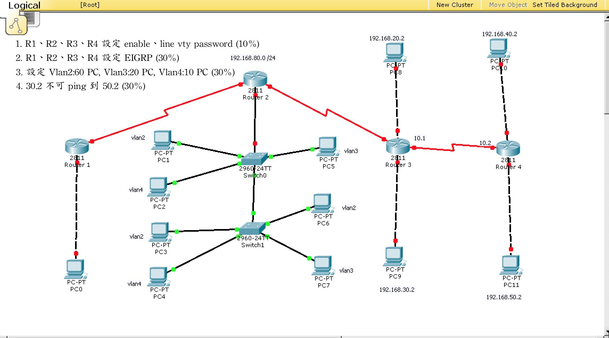
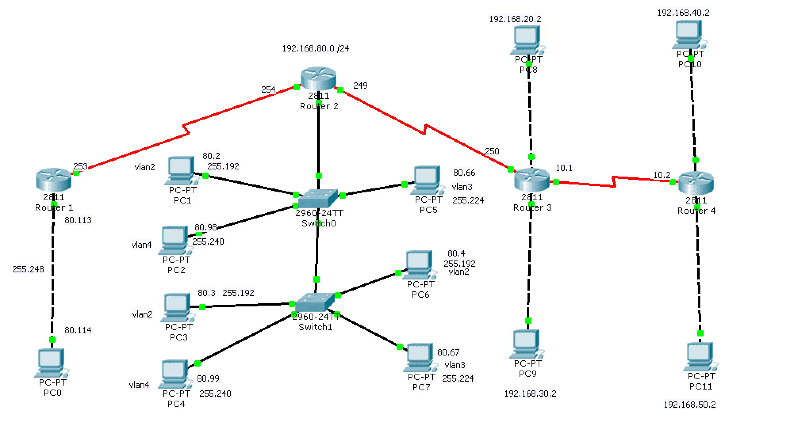
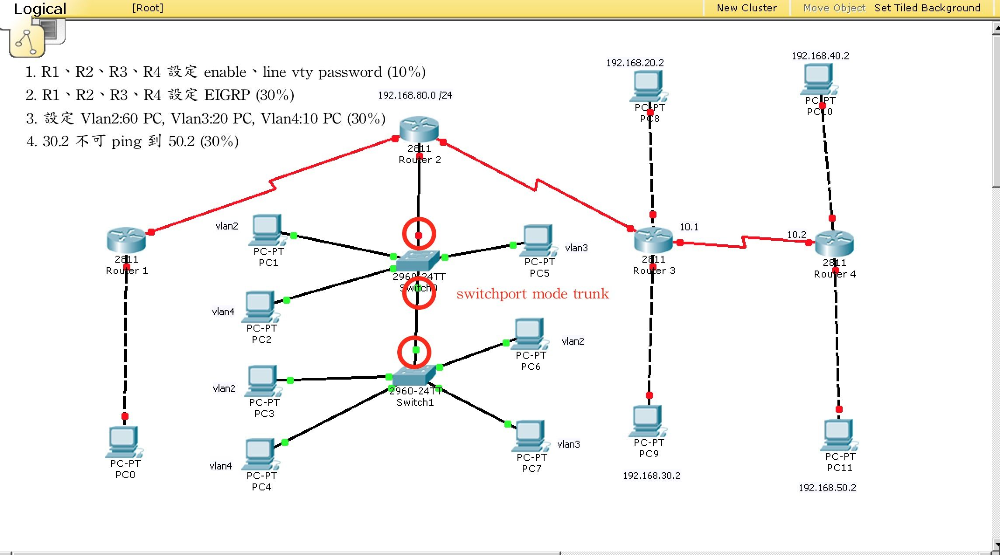
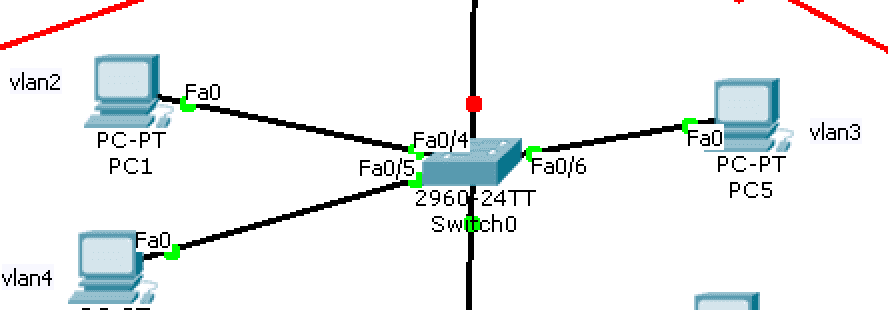
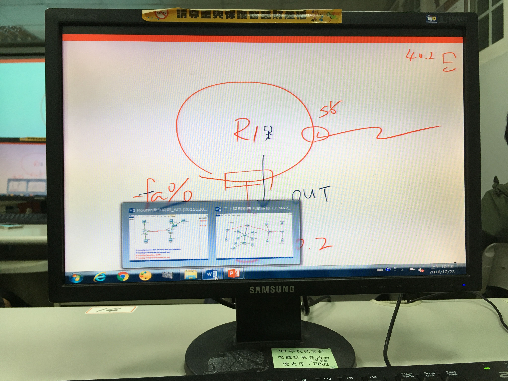

# ACL Packet Tracert Cisco CLI


## 提供的檔案

[簡報](networks_tracer/期末考實作.html)

[Final Exam(6.0).pkt](networks_tracer/Final_Exam(6.0).pkt)

## 要求





## 切網段

| 順序   | 1       | 2       | 3       | 4       |
|--------|---------|---------|---------|---------|
| int    | vlan2   | vlan3   | vlan4   | R1      |
| 切台數 | 64      | 32      | 16      | 8       |
| 網段頭 | 80.0    | 80.64   | 80.96  | 80.112  |
| 網段尾 | 80.63   | 80.95   | 80.111  | 80.119  |
| 遮罩   | 255.192 | 255.224 | 255.240 | 255.248 |

<!-- more -->

## 設定 IP




## 子網段設定

```bash Subnet
[Router]$confi
Configuring from terminal, memory, or network [terminal]$?
Enter configuration commands, one per line.  End with CNTL/Z.
[Router1(config)]$ int fa0/0
[Router1(config-if)]$ no shutdown
[Router1(config-if)]$ int fa0/0.1
[Router1(config-subif)]$ ip address  192.168.80.1 255.255.255.192
```

## EIGRP 設定

```bash EIGRP
[Router1]$> en
[Router1]$ confi
Configuring from terminal, memory, or network [terminal]$?
Enter configuration commands, one per line.  End with CNTL/Z.
[Router1(config)]$ router eigrp 100
[Router1(config-router)]$ network 192.168.80.252
%DUAL-5-NBRCHANGE: IP-EIGRP 100: Neighbor 192.168.80.254 (Serial1/0) is up: new adjacency
[Router1(config-router)]$ network 192.168.80.112
```

```
[Router2(config)]$ router eigrp 100
[Router2(config-router)]$ network 192.168.80.254
[Router2(config-router)]$ network 192.168.80.249
[Router2(config-router)]$ network 192.168.80.0
[Router2(config-router)]$ network 192.168.80.64
[Router2(config-router)]$ network 192.168.80.96
```

```
[Router3(config)]$ router eigrp 100
[Router3(config-router)]$ network 192.168.80.250
%DUAL-5-NBRCHANGE: IP-EIGRP 100: Neighbor 192.168.80.249 (Serial1/0) is up: new adjacency
[Router3(config-router)]$ network 192.168.10.1
%DUAL-5-NBRCHANGE: IP-EIGRP 100: Neighbor 192.168.10.2 (Serial1/1) is up: new adjacency
[Router3(config-router)]$ network 192.168.20.1
[Router3(config-router)]$ network 192.168.30.1
[Router3(config-router)]$ no auto-summary
```

```
[Router4(config)]$ router eigrp 100
[Router4(config-router)]$ network 192.168.10.2
[Router4(config-router)]$ network 192.168.40.1
[Router4(config-router)]$ network 192.168.50.1
[Router4(config-router)]$ no auto-summary
```

## Switch Trunk




```bash Swich Trunk
[Switch0]$> en
[Switch0]$ confi
Configuring from terminal, memory, or network [terminal]$?
[Switch0(config)]$ int fa0/2
[Switch0(config-if)]$ switchport mode trunk
[Switch0(config-if)]$ int fa0/3
[Switch0(config-if)]$ switchport mode trunk
[Switch1(config)]$ int fa0/2
[Switch1(config-if)]$ switchport mode trunk
```

#### 設定Vlan、vlan name




```bash vlan name
[Switch]$> en
[Switch]$confi
Configuring from terminal, memory, or network [terminal]$?
Enter configuration commands, one per line.  End with CNTL/Z.
[Switch(config)]$ vlan 2
[Switch(config-vlan)]$ name v2
[Switch(config-vlan)]$ vlan 3
[Switch(config-vlan)]$ name v3
[Switch(config-vlan)]$ vlan 4
[Switch(config-vlan)]$ name v4
```

```bash group interface
[Switch(config-vlan)]$ int fa0/4
[Switch(config-if)]$ switchport access vlan2
[Switch(config-if)]$ switchport access vlan 2
[Switch(config-if)]$ int fa0/5
[Switch(config-if)]$ switchport access vlan 4
[Switch(config-if)]$ int fa0/6
[Switch(config-if)]$ switchport access vlan 3
```

到此已經完成要求2、3了。

## ACL 設定

#### 30.2不能ping 50.2

```bash ACL
[Router3]$>en
[Router3]$ confi
Configuring from terminal, memory, or network [terminal]$?
Enter configuration commands, one per line.  End with CNTL/Z.
[Router3(config)]$ access-list 10 deny host 192.168.50.2
[Router3(config)]$ access-list 10 permit any
[Router3(config)]$ int fa0/1
[Router3(config-if)]$ ip access-group 10 out
```



## 設定密碼

- Router 自己的密碼

```bash Enable Secret
[Router]$> en
[Router]$ confi
Configuring from terminal, memory, or network [terminal]$?
Enter configuration commands, one per line.  End with CNTL/Z.
[Router(config)]$ enable secret cisco
```

- 遠端登入的密碼

```bash Telnet Passwd
[Router]$> en
Password:
[Router]$ confi
Configuring from terminal, memory, or network [terminal]$?
Enter configuration commands, one per line.  End with CNTL/Z.
[Router(config)]$ line vty ?
  <0-15>  First Line number
[Router(config)]$ line vty 0 15
[Router(config-line)]$ password cisco
[Router(config-line)]$ login
```

## 遠端登入

```bash Telnet Login
[Router]$ >en
Password:
[Router1]$ telnet 192.168.80.254 ## 或是192.168.80.249
Trying 192.168.80.254 ...Open


User Access Verification

Password:
[Route2]$> en
Password:
[Router2]$ confi
Configuring from terminal, memory, or network [terminal]$?
Enter configuration commands, one per line.  End with CNTL/Z.
[Router(config)]$
```


