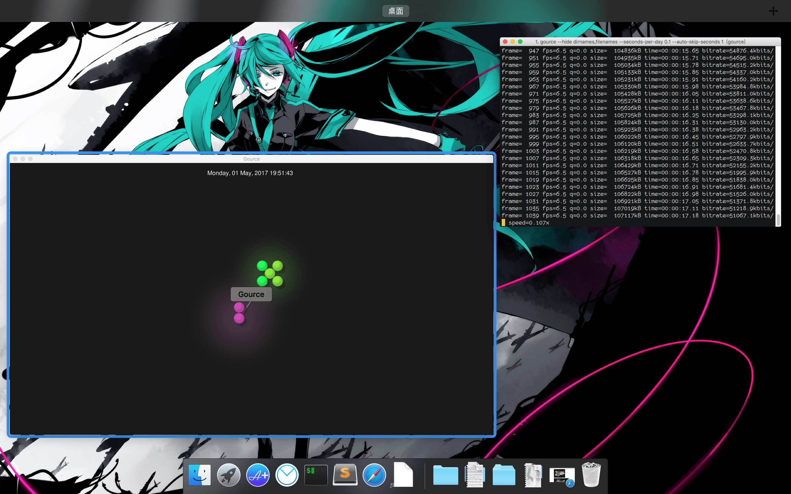
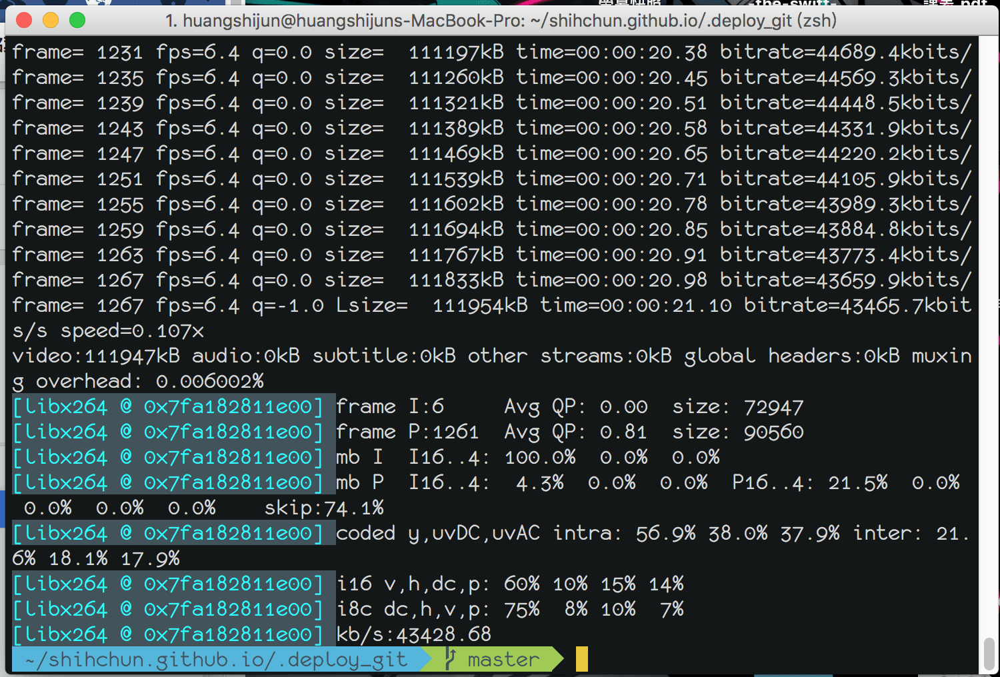

# Gource — GitHub Log Visualization




我一直很想試試看Gource這個玩意，但是之前一直沒有在使用GitHub，所以也沒有辦法玩，最近不知道為什麼突然使用過<(￣︶￣)↗[GO!]，所以就想要玩玩看這個東西，就結果而言，我是做出來了，HaHa！！

## 安裝項目

在這個過程中因為需要使用到Gource、ffmpeg，所以第一步就是安裝這兩個東西，還好Homebrew很強大可以直接用來安裝，不然我又要看一下資料了。

```bash
brew update
brew install ffmpeg
brew install gource
```

## 使用的目錄

安裝完之後，我cd（change directory）到我的repo下面執行gource的命令行，但是它卻給我報這個訊息：

```bash
cd myrepo_pwd
gource
fatal: your current branch 'master' does not have any commits yet
gource: failed to generate log file
Try 'gource --help' for more information.
```

經過一番的研究我發現可能是因為我使用的Hexo Depoly的命令行在執行的時候，會將我的檔案複製到另外一個資料夾才進行檔案提交的三個指令。

```bash
git add --all
git commit -m "Initial commit"
git push -u origin master
```

所以我去查了一下[hexo-deployer-git](https://github.com/hexojs/hexo-deployer-git)的說明，發現下面有一段話：

> # How it works
> hexo-deployer-git works by generating the site in .deploy_git and force pushing to the repo(es) in config. If .deploy_git does not exist, a repo will initialized (git init). Otherwise the curent repo (with its commit history) will be used.
>
>Users can clone the deployed repo to .deploy_git to keep the >commit history.
>
>``` git clone .deploy_git```

```bash
hexo g -d
```

所以我認為上面的指令是把檔案轉換（hexo g)，在丟到`public`目錄，再複製到個叫做`.deploy_git`的隱藏資料夾進行檔案提交的，所以我的`.git log`一定就在這裡。




```bash
gource --hide dirnames,filenames --seconds-per-day 0.1 --auto-skip-seconds 1 -1280x720 -o - | ffmpeg -y -r 60 -f image2pipe -vcodec ppm -i - -vcodec libx264 -preset ultrafast -pix_fmt yuv420p -crf 1 -threads 0 -bf 0 pwd_gource.mp4
```


