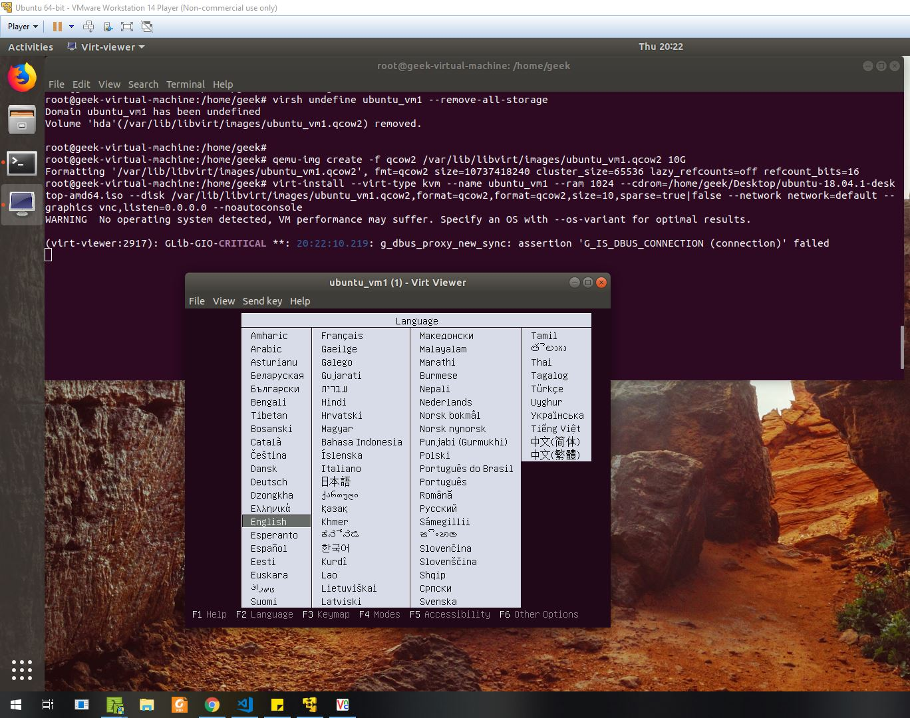
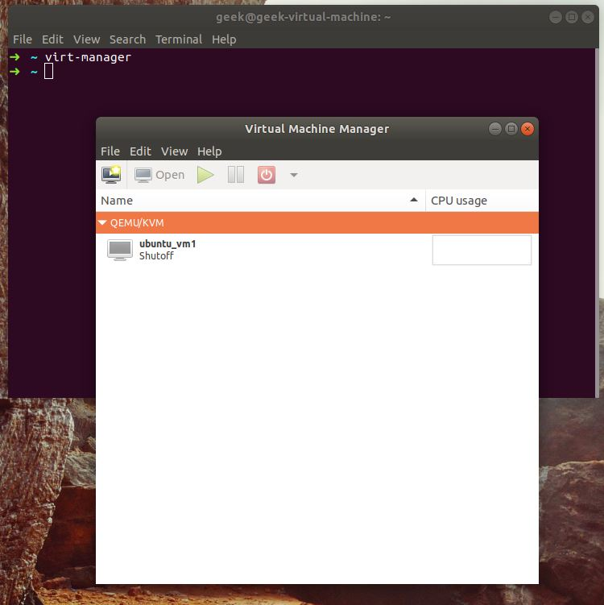

# KVM安裝


KVM (Kernel-based Virtual Machine) is a virtuallation ifrastructure for the Linux that turns the Linux kernel into a hypervisor.

….Libvirt可以管理KVM，透過甚至Libvirt可以使用Openstack做雲端計算，實現位置監控以及自動化


## How it works

It works with

GNU / LINUX

- User Space
- Kernel Space

```bash
# top
```
[](https://asciinema.org/a/nXUBDZIFTOYryF3lr9k9Vwr7S)

而KVM的虛擬機virtual machine就是透過QEMU去做安裝的，如果要使用虛擬機KVM的話用像VMware一樣有嵌套虛擬化的VM工具，可以在虛擬機下面執行虛擬機，還有V-td（Intel）的功能也要打開，AMD系列主機板則是AMD-V。


# 安裝 KVM

Determine the if Hardware virtualization is Enabled or not.

```bash
# grep -E '(vmx|svm)' /proc/cpuinfo 
or
# egrep "vmx|svm" /proc/cpuinfo
```

kvm需要安裝`qemu-kvm`、`libvirt`，kvm就不用說明了，libvirt是做虛擬機管理用的。

使用指令建立虛擬機的優點就是可以選擇建立的各個參數，例如磁碟鏡像使用raw聽說是相對而言最快的，但是virt-manager卻只可以建立建立qcow2，當然格式這些可以互相轉換。


```bash
$ sudo apt-get install qemu-kvm libvirt-bin virtinst
$ systemctl enable libvirtd
$ systemctl start libvirtd
$
## 建立10GB的虛擬硬碟
qemu-img create -f qcow2 /var/lib/libvirt/images/ubuntu_vm1.qcow2 10G
qemu-img info ubuntu_vm1.qcow2
## 用virtinst 安裝 （預設vnc port=5900）
$ virt-install --virt-type kvm --name ubuntu_vm1 --ram 1024 \
--cdrom=/opt/ubuntu-18.04.1-desktop-amd64.iso \
--disk /var/lib/libvirt/images/ubuntu_vm1.qcow2,format=qcow2,format=qcow2,size=10,sparse=true|false \
--network network=default \
--graphics vnc,listen=0.0.0.0 --noautoconsole \
--os-type=linux --os-variant=ubuntutrusty

WARNING  No operating system detected, VM performance may suffer. Specify an OS with --os-variant for optimal results.
ERROR    Couldn't create storage volume 'ubuntu_vm1.qcow2': '[Errno 32] Broken pipe'
Domain installation does not appear to have been successful.
If it was, you can restart your domain by running:
  virsh --connect qemu:///system start ubuntu_vm1

## 重新執行一次

$ virsh --connect qemu:///system start ubuntu_vm1
$ virt-install --virt-type kvm --name ubuntu_vm1 --ram 1024 \
--cdrom=/opt/ubuntu-18.04.1-desktop-amd64.iso \
--disk /var/lib/libvirt/images/ubuntu_vm1.qcow2,format=qcow2,format=qcow2,size=10,sparse=true|false \
--network network=default \
--graphics vnc,listen=0.0.0.0 --noautoconsole \
--os-type=linux --os-variant=ubuntutrusty

## 格式轉換 ： qcow2 , qed , raw , vdi , vpc , vmdk
## The qcow2 type can be created if the qemu-img tool is present. The others are dependent on support of the qemu-img tool.

# example kvm -> vmware
$ qemu-img convert -f raw -O vmdk -p windows.raw /run/media/geek/2TB/Virtual\ Machines/Windows/windows.vmdk
$ vmkfstools -i windows.vmdk -d thin windows_transfered.vmdk
```




在經過折騰一陣之後我發現直接用virt-manager安裝就行了，指令安裝可能有它的好處在吧！

```bash
$ sudo apt-get install qemu-kvm libvirt-bin virtinst virt-manager
$ systemctl enable libvirtd
$ systemctl start libvirtd
$ virt-manager
# 圖形界面
```


## vnc server

安裝vnc server，並且啟動vncserver，可以在遠端透過vnc遙控vm主機

```bash
$ sudo apt install xfce4 xfce4-goodies
$ sudo apt install tightvncserver
$ vncserver

You will require a password to access your desktops.

Password: 
Verify:   
Would you like to enter a view-only password (y/n)? y
Password: 
Verify:   

New 'X' desktop is geek-virtual-machine:1

Creating default startup script /home/geek/.vnc/xstartup
Starting applications specified in /home/geek/.vnc/xstartup
Log file is /home/geek/.vnc/geek-virtual-machine:1.log
```

## virsh list 查看/啟動/刪除 kvm

```bash
$ virsh list --all
 Id    Name                           State
----------------------------------------------------
 -     ubuntu_vm1                     shut off
$ virsh start ubuntu_vm1
Domain ubuntu_vm1 started

## 如果要刪除 KVM
$ virsh undefine ubuntu_vm1 --remove-all-storage
Domain ubuntu_vm1 has been undefined
Volume 'hda'(/opt/ubuntu_vm1.qcow2) removed.

## 遠端連線範例
$ virsh --connect qemu+ssh://geek@192.168.59.129/system list --all
```

## 虛擬機管理

libvirt管理虛擬機有一個很大的優點，就是在管理的過程中，如果libvirt不動作了，不會影響到KVM，他們沒有依賴關係。

```bash
$ pwd
/etc/libvirt/qemu
$ ll
total 12K
drwxr-xr-x 3 root root 4.0K Oct 31 23:01 networks
-rw------- 1 root root 4.1K Nov  1 20:22 ubuntu_vm1.xml
```

```xml
<!--
WARNING: THIS IS AN AUTO-GENERATED FILE. CHANGES TO IT ARE LIKELY TO BE
OVERWRITTEN AND LOST. Changes to this xml configuration should be made using:
  virsh edit ubuntu_vm1
or other application using the libvirt API.
-->

<domain type='kvm'>
  <name>ubuntu_vm1</name>
  <uuid>eb6f6313-ba45-4255-8df3-89773ef183b4</uuid>
  <memory unit='KiB'>1048576</memory>
.
.
.
```

在`etc`目錄下面`libvirt`個設定檔案，告訴我們說他的設定是自動生成的，要我們自行去用指令做設定。

ip addr del dev eth0 192.168.56.32/24

## 虛擬機網路管理

libvert networking 可以使用Linux Virtual Networking的virtual network switch來達到layer2使用TAP指令、layer3 使用TUN(tunnel) 指令。

…..To be continue


