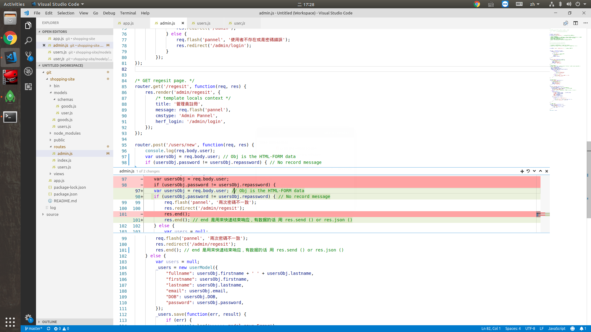
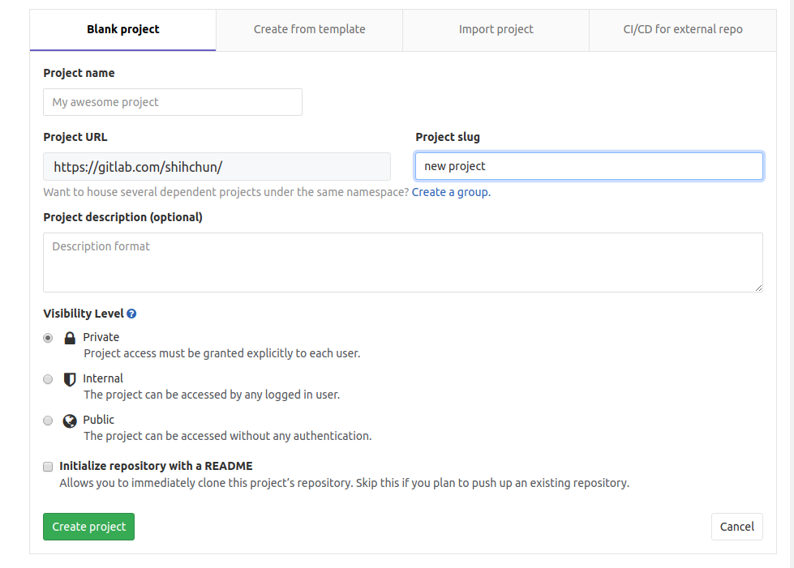
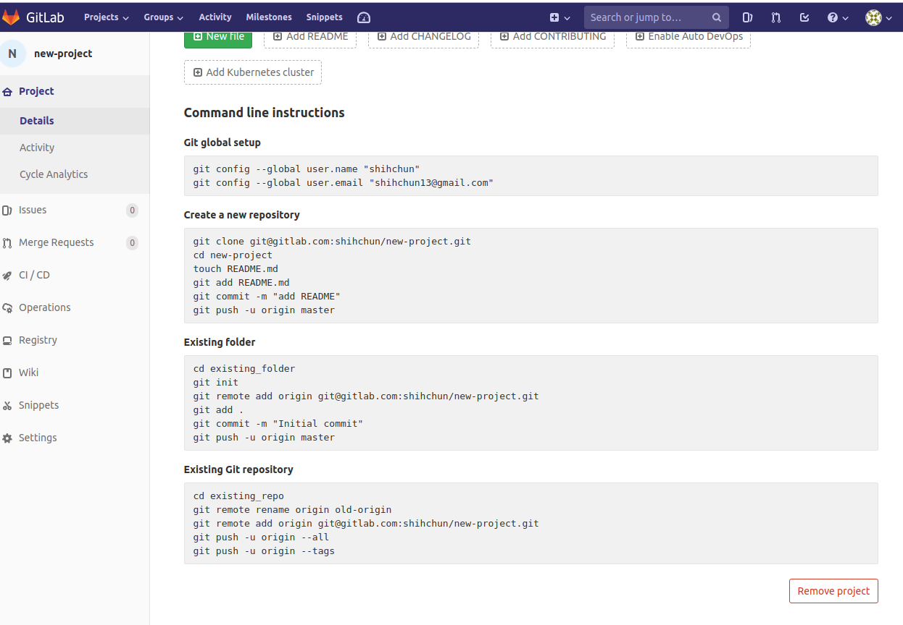
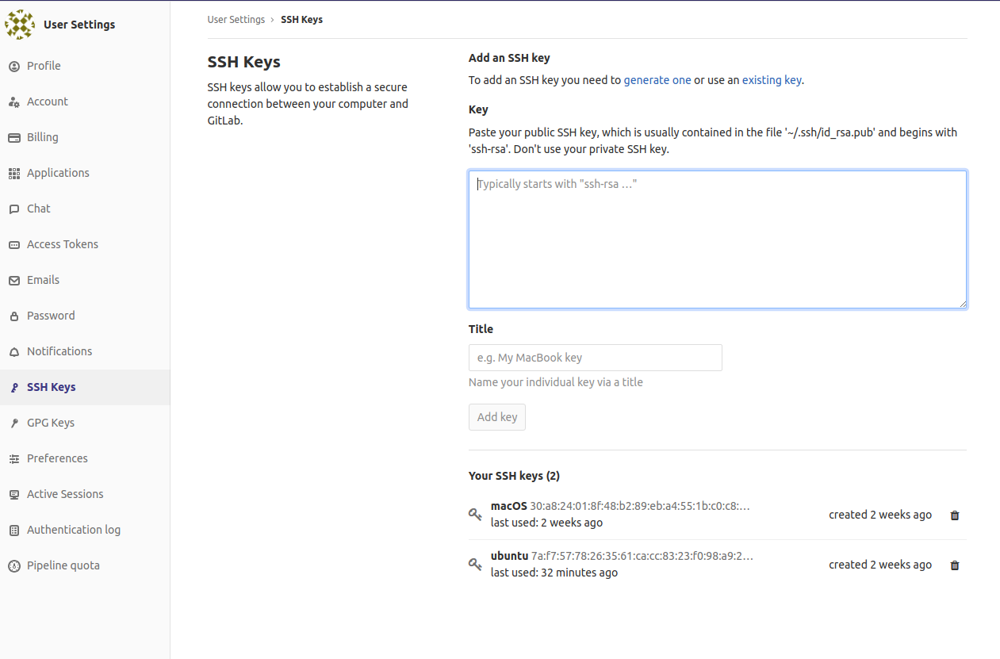

# Git 使用


## 編輯現有的project

```bash
git clone https://www.gitxxx/xxx/xxx.git
## 編輯完之後上傳
git add .
git commit -m "commit message 可以寫做什麼修改"
## 上傳
git push -u orgin master ## push 到叫做orgin的xxx.git
```

## 檢查要push的地方

```bash
git remote -v

origin	git@gitxxx.com:xxx/xxx.git (fetch)
origin	git@gitxxx.com:xxx/xxx.git (push)

## 上傳到別的位置
git remote add new_one https://www.gitxxx/xxx/xxx.git
git remote -v

new_one	git@gitxxx.com:xxx/xxx.git (fetch)
new_one	git@gitxxx.com:xxx/xxx.git (push)
origin	git@gitxxx.com:xxx/xxx.git (fetch)
origin	git@gitxxx.com:xxx/xxx.git (push)

## 如果有新的commit的話可以使用
git push -u orgin master
git push -u new_one master
```

## 使用Git的好處

可以檢閱各個版本的差別，最近發現vs code還有一個git的功能，就像下圖所示的，可以查看上個版本刪減增加的內容。



Git的基本使用方法非常簡單，首先要先在github或是gitlab創建賬號，然後設定好ssh連線，在這之前要安裝並且設定[git](https://git-scm.com/)





## Git 初始設定

這個地方要設定你git代碼託管的username以及email，你班在創建完git網頁上的賬號之後，可以在profile的地方看到，你的fullname和email。

```bash
git config --global user.name "git_username"
git config --global user.email "git_email"
```

# SSH 設定

再來是設定SSH的部分，如果不是要設定多個SSH連線，可以不用建立config檔案

```bash
sudo apt-get install ssh
touch ~/.ssh/config
# 給與shell執行權限
sudo chmod 755 ~/.ssh # 解決連線permission問題
```

編輯`~/.ssh/config`

```bash
# Github
Host github.com
    HostName github.com
    PreferredAuthentications publickey
    IdentityFile ~/.ssh/id_rsa
# Gitlab
Host gitlab.com
    HostName gitlab.com
    PreferredAuthentications publickey
    IdentityFile ~/.ssh/id_ed25519
```

然後重新啓動SSH

```bash
## 重啓ssh
sudo service ssh restart # ubuntu centos
sudo systemctl restart sshd.service # arch manjaro
# macOS
sudo launchctl stop com.openssh.sshd
sudo launchctl start com.openssh.sshd
```

## 建立SSH KEY

Github和Gitlab都有介紹如何建立ssh連線，照着操作就行了，只要記得把設定檔IdentityFile輸對就行了。



最後，再測試看看連線

```bash
ssh -T git@gitlab.com
Welcome to GitLab, @shihchun!
ssh -T git@github.com 
Hi shihchun! You've successfully authenticated, but GitHub does not provide shell access.
```
