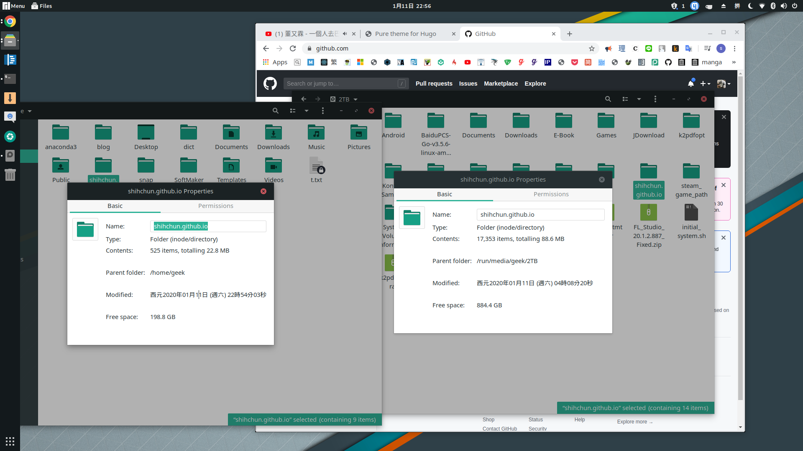

# 從Hexo到Hugo


## 原因

隨着文章增加，雖然沒有些什麼東西，漸漸的發現在靜態檔案轉換的速度漸漸的變慢了，發現Hexo的速度以及它`plugin`過度依賴的問題太過於明顯，前一陣子因為`plugin`的問題弄了很久，放假時間就試着使用hugo了。

之前使用的是Hexo-NexT的主題，就不介紹了，是一個我很喜歡的主題，有我喜歡的Local Search的功能，也不知道為什麼很多的都不寫，雖然網路上看到一些高手想到的解決方案，但是如果可以直接有的主題還是我的首選，所以我就使用`hugo-theme-pure`了。

下面是我轉到Hugo下面的主題架構檔案大小，之前用Hexo的時候，檔案非常難以移動，現在比較好搬動了，下面的檔案大小還是我將轉出來的`public`，也就是上傳到github page的部分刪掉的大小，相對而言，Hugo實在是優秀太多了，只是hexo對剛開始使用的人真的也是非常友好，上傳github有hexo d的指令可以使用，如果用hugo的話，就要自己重新add remote xx.git，然後重新add、commit、push一次。



這篇文章大概整理一下換hugo使用的過程遇到的地方。

## hugo 安裝

我在Manjaro linux上面使用，所以直接在Add/Remove Software加上去就解決了。不過官方也有說怎麼做安裝的動作，Windows用Chocolatey，Macos用Homebrew。

現在的Loveit在新版本會有一些問題，所以需要安裝<=0.74.3的版本，在window上面安裝的話可以使用choco版本安裝工具部署

當然在Linux上，例如滾動式更新的Manjaro之類的可能找不到相應版本，所以需要去尋求Github的原始版本，不過還好，Release上面有building的執行檔


```sh
choco install hugo --version=0.74.3
choco install hugo-extended --version=0.74.3

## 加入Linux 環境變量
export PATH=/home/$USER/hugo:$PATH
source ~/.zshrc
```


```
～
$ hugo new site site_name
$ cd site_name/themes
$ git clone https://github.com/xiaoheiAh/hugo-theme-pure.git pure
$ cd ~/site_name
$ cp site_name/themes/exampleSite/config.yml config.yml
$ hugo server
```

## 上傳到之前的 github page

首先是這個theme的設定檔案`./config.yml`的`baseURL`要填入你的github page的網址，hugo官方也有提到相關的問題，如果沒有加入的話會導致css無法讀取，踩過地雷，記錄一下。

```bash
baseURL: https://xxxxxxx.github.io
theme: pure
title: Pure theme for Hugo
defaultContentLanguage: zh  # en/zh/...
footnoteReturnLinkContents: ↩
hasCJKLanguage: true
paginate: 7
enableEmoji: true
PygmentsCodeFences: false
googleAnalytics: "UA-97401827-1"      # UA-XXXXXXXX-X 
permalinks:
  posts: /:year/:month/:filename/
```

首先假設你已經設定好github的指令，其實就是把`.git`隱藏資料架拿來。
- 用clone的方式

```bash
cd site_name && rm -rf public
git clone https://www.gitxxx/xxx/xxx.git
mv xxx.github.io public && hugo
cd public && git add. && git commit -m "add" 
git push -u origin master
```

- 另一種

```bash
cd site_name/public
git init
git remote -v # 有的話就不用加了
git remote add origin https://www.gitxxx/xxx/xxx.git
git pull && hugo ## 要先拉再推
git add .
git commit -m "update to hugo from hexo"
git push -u origin master # 還是不行就加-f
```

## Disqus

pure的disqus不能用，`./config.yml`的地方要把disqus註解掉，按照官方的做法去做。

```yaml
# 手動加入disque，/layouts/partials/: 裡新增 disqus.html
# /layouts/partials/article:
# <div class="disqus markdown">
#     {{ partial "disqus.html" . }}
# </div>
  # Comment
  comment:
    type:  #disqus # type disqus/gitalk/valine 启用哪种评论系统
    disqus: #xxxxxxxx # enter disqus shortname here
disqusShortname: shortname
```

然後手動加入disqus，`/layouts/partials/` 裡新增 `disqus.html`

```html
<div id="disqus_thread"></div>
<script type="text/javascript">
    console.log('{{ .Site.DisqusShortname }}');
    (function() {
        // if (window.location.hostname == "localhost")
        //     return;
        var dsq = document.createElement('script'); dsq.type = 'text/javascript'; dsq.async = true;
        var disqus_shortname = '{{ .Site.DisqusShortname }}';
        dsq.src = '//' + disqus_shortname + '.disqus.com/embed.js';
        (document.getElementsByTagName('head')[0] || document.getElementsByTagName('body')[0]).appendChild(dsq);
    })();
</script>
<noscript>Please enable JavaScript to view the <a href="http://disqus.com/?ref_noscript">comments powered by Disqus.</a></noscript>
<a href="http://disqus.com/" class="dsq-brlink">comments powered by <span class="logo-disqus">Disqus</span></a>
```

再來在`/layouts/partials/article`的`</article>` ，加載在之前的`pure`做的comment的位置就行了

## hugo mathjax顯示

有些themes沒有辦法辨識mathjax，通常這樣可以解決，我用的theme不用作者有做了。

在`themes/theme-name/layouts/head.html`貼上

```html
<script type="text/javascript" async
  src="https://cdn.mathjax.org/mathjax/latest/MathJax.js?config=TeX-AMS-MML_HTMLorMML">
  MathJax.Hub.Config({
  tex2jax: {
    inlineMath: [['$','$'], ['\\(','\\)']],
    displayMath: [['$$','$$']],
    processEscapes: true,
    processEnvironments: true,
    skipTags: ['script', 'noscript', 'style', 'textarea', 'pre'],
    TeX: { equationNumbers: { autoNumber: "AMS" },
         extensions: ["AMSmath.js", "AMSsymbols.js"] }
  }
  });
  MathJax.Hub.Queue(function() {
    // Fix <code> tags after MathJax finishes running. This is a
    // hack to overcome a shortcoming of Markdown. Discussion at
    // https://github.com/mojombo/jekyll/issues/199
    var all = MathJax.Hub.getAllJax(), i;
    for(i = 0; i < all.length; i += 1) {
        all[i].SourceElement().parentNode.className += ' has-jax';
    }
  });

  MathJax.Hub.Config({
  // Autonumbering by mathjax
  TeX: { equationNumbers: { autoNumber: "AMS" } }
  });
</script>
```

## 自動跳文章目錄

在`pure/assets/js/application.js`，23行左右加入，最後我也拿掉了，感覺沒什麼用

```js
 $('#collapseToc').on('shown.bs.collapse', function() {
    // do something…
    // slimscroll
    if (typeof $.fn.slimScroll != 'undefined') {
      $(".sidebar .slimContent").slimScroll().on('slimscroll');
    }
  });
  
  // s 自動切換至 文章目錄（用toc-list), 
  // tocbot.init在/theme/layout/partial/script.html裏面設定 
  //$('.collapse').collapse()
  $('#collapseToc.collapse').collapse()

```
