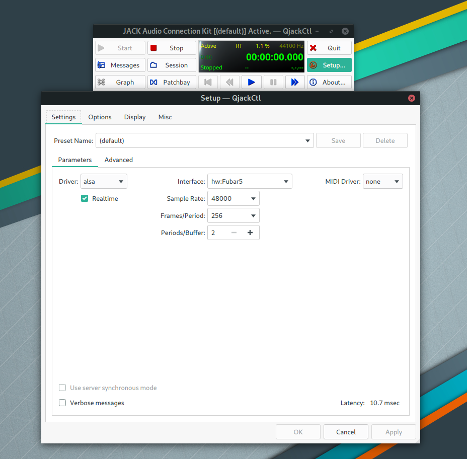
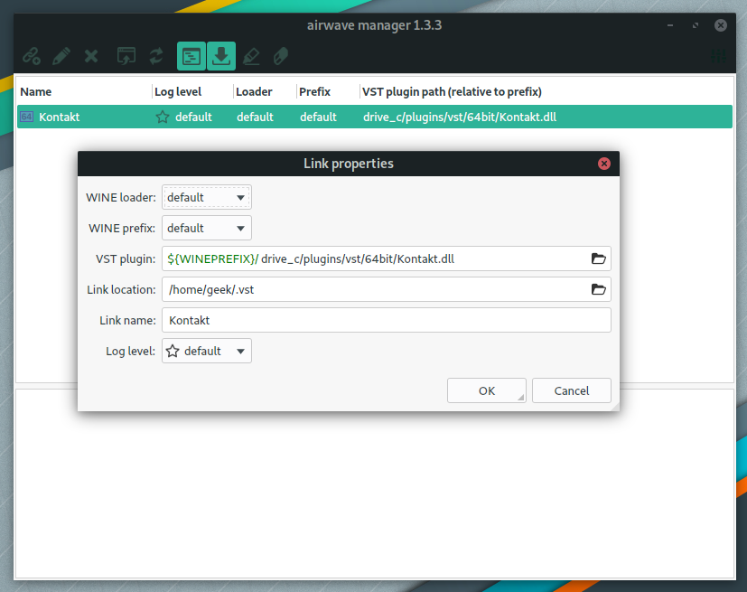
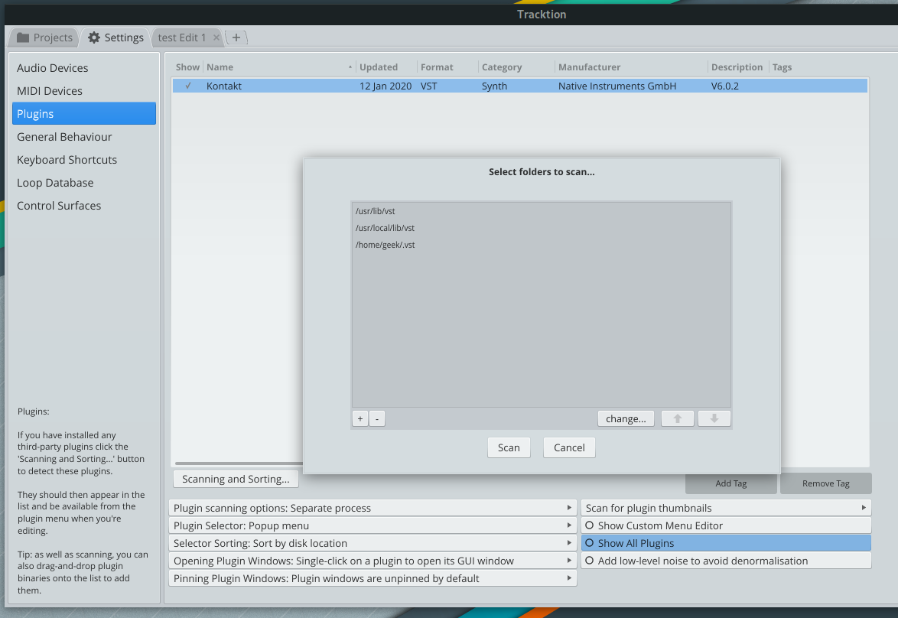

# Jack2+cadence 低延遲輸出




## 安裝Jack2、qJackCtl、cadence

我是使用Manjaro community的版本。

然後打開qjackCtl設備調整成地延遲的DAC設備。



再來設定cadence

！[](Screenshot_from_2020-01-13_14-52-10.png "Cadence設定")
！[](Screenshot_from_2020-01-13_14-52-54.png "Cadence設定裝置")

另外如果之後重新開機之後如果cadence沒有啟動的話，可以試試看這個指令：

```bash
cadence-session-start --system-start
```

## airwave 和 windws vst

首先必須先在wine的系統裡面安裝windows的vst。

```bash
wine xxx.exe
mv plugin ~/.wine/drive_c/plugins #*.dll vst file if have
```

再來就是airwave wine plugin了



其中有兩個東西要設定，分別是`VST plugin`和`Link location`

VST plugin就是你VST plugin的`*.dll`的檔案

`Link location`則是airwave要在哪裡給DAWs存取。

例如我設定在`/home/geek/.vst`，DAWs就要在這裡找plugin，下面是Tracktion 7 的例子


