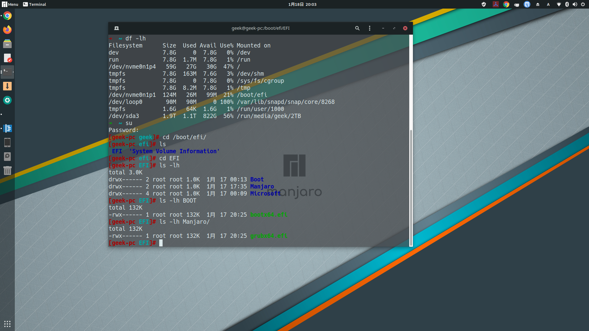

# Manjaro 雙系統安裝


## 切出空間

在Windows或是其他系統中分割出空間，在Windows管理下面壓縮磁區，或是在MacOS上面建立FAT32的磁區。

## 安裝

在EFI磁區加入掛載點:

- `/boot/efi`

flag選:
- `boot`
- `esp`

剩下的磁區分割就剩下:
- ext4 `/`, flag: root
- ext4 `/home`, flag home
- linuxswap, flag: `swap`

說一下我的分割方式，我是直接全部切50G全部給`/`、`root`。

由於Linux其實不用swap也可以運作，所以就沒有切了，如果記憶體真的比較小的舊電腦，還是建議切幾個GB給SWAP。

## NTFS、APFS讀取問題

### Windows

要關掉電源的像是Fast startup、Hybrid Sleep的設定，不然就算有`ntfs-3g`，在Linux上面也沒有硬碟的寫入權限，只能讀取。

在Power shell上打入

```
REG ADD "HKLM\SYSTEM\CurrentControlSet\Control\Session Manager\Power" /V HiberbootEnabled /T REG_dWORD /D 0 /F
```

現在在Linux上也可以解決這個問題，但是應該還是在Windows解決比較對，除非已經安裝成完全爲Linux

在Linux上使用`ntfsprogs`工具可以解決這個問題

```bash
df -lh # 查看設備容量
sudo ntfsfix /dev/sda 
```

### MacOS

插上電源，關閉FileVault。

然後到Linux系統下：
- 安裝 apfs-fuse

apfs比較麻煩的地方是不會自動掛載，要打指令，這個應該可以使用別的方法解決。

反正就暫時記錄如何掛載。

```bash
~
sudo fdisk -l # 我的apfs在sda2
mkdir macos
sudo apfs-fuse -o allow_other /dev/sda2 ~/macos
```

有人說需要把linux efi驅動覆蓋一次，到apple的驅動，我是覺得不用。


