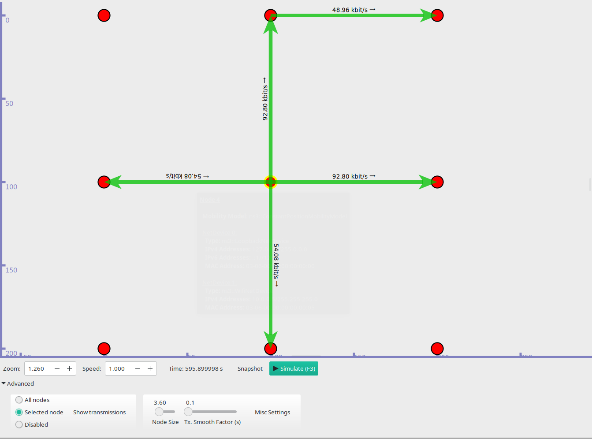
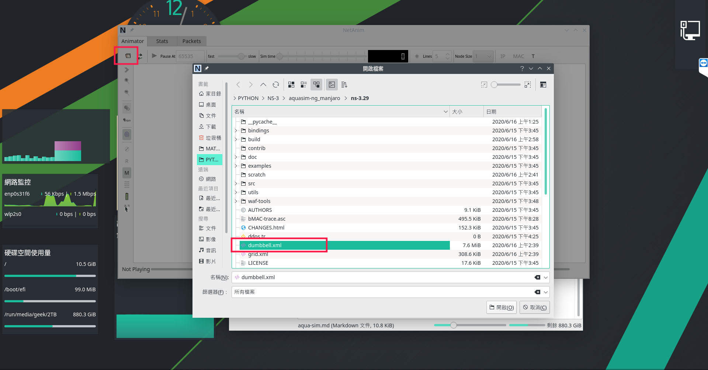
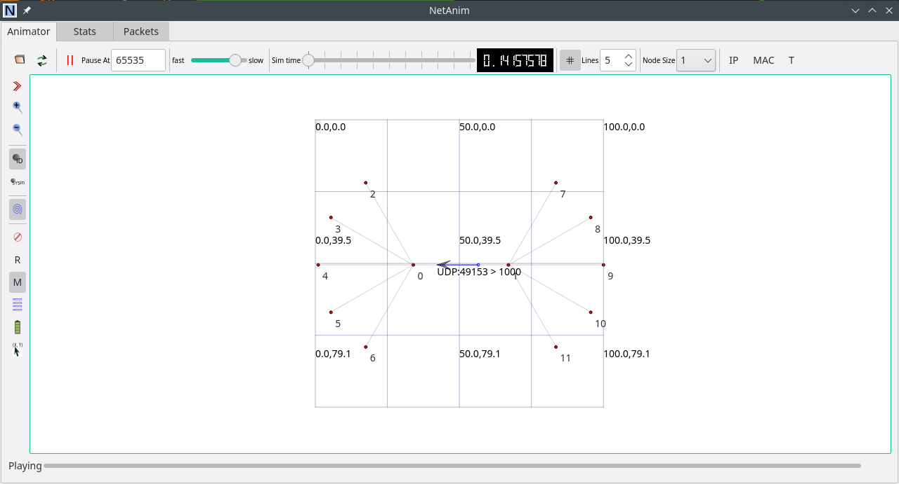
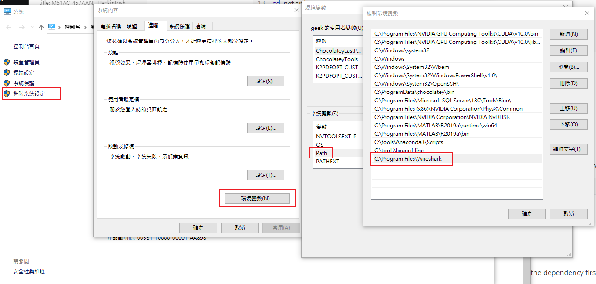
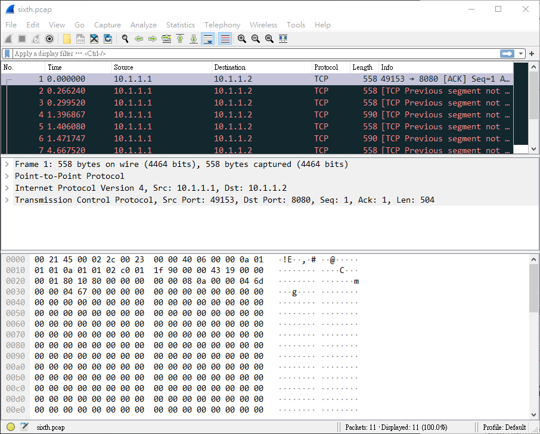
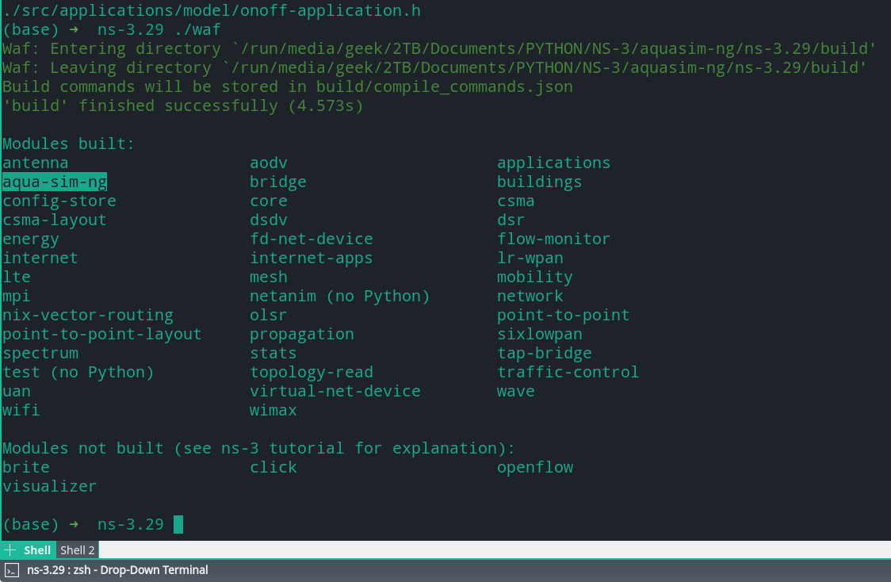

# NS3 installation


## Install NS3

Install the dependency of the NS3, I try to install all of them as I can. See the [NS3 wiki](https://www.nsnam.org/wiki/Installation).


### gccxml

If you use the wsl (ubuntu 18.04), then you may have the problem with the gccxml. I just build it from source code in the [official site](https://gccxml.github.io/HTML/Install.html), but the cmake command not works for me, I just google it, find the solution as below:

```bash
cmake -D CMAKE_C_FLAGS=-fgnu89-inline ../gccxml
make
sudo make install
```

wsl visualization by choco install VcXsrv

```bash
choco install vcxsrv # open it and binding the port '0'
wsl
sudo apt-get install x11-apps
echo "export DISPLAY=127.0.0.1:0" >> ~/.zshrc
xeyes
```

You may have problem with python header not found and the pip installation

```bash
sudo apt-get install libpython2.7-dev # header prob
wget https://bootstrap.pypa.io/get-pip.py # get_pip.py script download
python2 get_pip.py
python3 get_pip.py
alias pip2="python2 -m pip" # add the alias to the ~/.bashrc or ~/.zshrc
alias pip3="python -m pip"
```

### PyViz

```bash
./waf configure --enable-tests --enables-examples --with-python=python2
...
# see Pyviz: enable
./waf #build
./waf --pyrun src/flow-monitor/examples/wifi-olsr-flowmon.py --vis #Run sample
```

```bash
pip2 install pybindgen pyviz graphviz # in doc have py... install if you can
./waf configure --enable-tests --enables-examples --with-python=python2 # 3.29 is --python=python2
./waf --pyrun src/flow-monitor/examples/wifi-olsr-flowmon.py --vis #Run sample
```




### NetAnim

```bash
➜  ns-3.29 ./waf --run "dumbbell-animation --nLeftLeaf=5 --nRightLeaf=5 --animFile=dumbbell.xml"
(base) ➜  aquasim-ng_manjaro tree -L 1            
.
├── AquaSim-NG_Installation
├── bake
├── build.py
├── constants.py
├── netanim-3.108
├── ns-3.29
├── pybindgen-0.17.0.post58+ngcf00cc0
├── README
└── util.py
cd netanim-3.108
make clean 
qmake NetAnim.pro
make
./NetAnim
```






## Wireshark PCAP

If you use the wsl to do packet capture (PCAP), you can install the wireshark, and just add it to the windows env.

```bash
choco install wireshark
```

Then add to the env.



Then just use it in wsl by this way.

```bash
./waf --run sixth
wireshark.exe sixth.pcap
```



## Aquasim-ng

Aquasim-ng installation, to install it download the files from zheng peng’s wiki, install the dependency first, ref [here](https://www.nsnam.org/wiki/Installation)

```bash
wget http://hudson.ccny.cuny.edu/download/aquasim-ng.tgz
```


after you download it, you can try as below:

[](https://asciinema.org/a/eOFGEwuL947wtvWKrFTR4pnwy)

> Pyviz issue in this version 3.29 ref here AttributeError: 'gi.repository.GooCanvas' object has no attribute ‘LineDash’ `line_dash=GooCanvas.LineDash()` cange to `line_dash=GooCanvas.CanvasLineDash.newv()`

After you build successly, you’d better remove the `-Werror` in the `ns3/build/c4che/_c4che.py`

> after you build successly
> remove ns3/build/c4che/_c4che.py remove all -Werror
> cc1plus: all warnings being treated as errors




## 5g lena

I build failed with this info on the wsl, it means I missing the file in `/build/ns3`, but works in my manjaro kde.

```bash
dpkg -l | grep "sqlite"
ii  libqt5sql5-sqlite:amd64                   5.9.5+dfsg-0ubuntu2.5               amd64        Qt 5 SQLite 3 database driver
ii  libsqlite0                                2.8.17-14fakesync1                  amd64        SQLite 2 shared library
ii  libsqlite0-dev                            2.8.17-14fakesync1                  amd64        SQLite 2 development files
ii  libsqlite3-0:amd64                        3.22.0-1ubuntu0.4                   amd64        SQLite 3 shared library
ii  libsqlite3-dev:amd64                      3.22.0-1ubuntu0.4                   amd64        SQLite 3 development files
ii  libsqlite3-ocaml                          4.0.5-2build1                       amd64        Embeddable SQL Database for OCaml Programs
ii  libsqlite3-ocaml-dev                      4.0.5-2build1                       amd64        Embeddable SQL Database for OCaml Programs
ii  sqlite                                    2.8.17-14fakesync1                  amd64        command line interface for SQLite 2
ii  sqlite3                                   3.22.0-1ubuntu0.4                   amd64        Command line interface for SQLite 3

./waf configure --enable-tests --enable-examples --with-python=python2 --enable-mpi
Setting top to                           : /mnt/d/Documents/PYTHON/NS-3/wsl-ns-3-dev
Setting out to                           : /mnt/d/Documents/PYTHON/NS-3/wsl-ns-3-dev/build
Checking for 'gcc' (C compiler)          : /usr/bin/gcc
Checking for cc version                  : 7.5.0
Checking for 'g++' (C++ compiler)        : /usr/bin/g++
Checking for compilation flag -Wl,--soname=foo support : ok
Checking for compilation flag -std=c++11 support       : ok
Checking boost includes                                : 1_65_1
Checking boost libs                                    : ok
Checking for boost linkage                             : ok
Checking for program 'python'                          : python2
Checking for python version >= 2.3                     : 2.7.17
python-config                                          : /usr/bin/python2-config
Asking python-config for pyembed '--cflags --libs --ldflags --embed' flags : not found
Asking python-config for pyembed '--cflags --libs --ldflags' flags         : yes
Testing pyembed configuration                                              : yes
Asking python-config for pyext '--cflags --libs --ldflags' flags           : yes
Testing pyext configuration                                                : yes
Checking for compilation flag -fvisibility=hidden support                  : ok
Checking for compilation flag -Wno-array-bounds support                    : ok
Checking for pybindgen location                                            : not found
Checking for python module 'pybindgen'                                     : 0.21.0
Checking for pybindgen version                                             : 0.21.0
Checking for code snippet                                                  : yes
Checking for types uint64_t and unsigned long equivalence                  : no
Checking for code snippet                                                  : no
Checking for types uint64_t and unsigned long long equivalence             : yes
Checking for the apidefs that can be used for Python bindings              : gcc-LP64
Checking for internal GCC cxxabi                                           : complete
Checking for python module 'pygccxml'                                      : 1.9.1
pygccxml version cannot be determined
Checking for click location                                                : not found
Checking for program 'pkg-config'                                          : /usr/bin/pkg-config
Checking for 'gtk+-3.0'                                                    : yes
Checking for 'libxml-2.0'                                                  : yes
checking for uint128_t                                                     : not found
checking for __uint128_t                                                   : yes
Checking high precision implementation                                     : 128-bit integer (default)
Checking for header stdint.h                                               : yes
Checking for header inttypes.h                                             : yes
Checking for header sys/inttypes.h                                         : not found
Checking for header sys/types.h                                            : yes
Checking for header sys/stat.h                                             : yes
Checking for header dirent.h                                               : yes
Checking for header stdlib.h                                               : yes
Checking for header signal.h                                               : yes
Checking for header pthread.h                                              : yes
Checking for header stdint.h                                               : yes
Checking for header inttypes.h                                             : yes
Checking for header sys/inttypes.h                                         : not found
Checking for library rt                                                    : yes
Checking for header sys/ioctl.h                                            : yes
Checking for header net/if.h                                               : yes
Checking for header net/ethernet.h                                         : yes
Checking for header linux/if_tun.h                                         : yes
Checking for header netpacket/packet.h                                     : yes
Checking for NSC location                                                  : not found
Checking for ''                                                            : yes
Checking for OpenFlow location                                             : not found
Checking for 'sqlite3'                                                     : yes
Checking for header linux/if_tun.h                                         : yes
Checking for python module 'gi'                                            : 3.26.1
Checking for python module 'gi.repository.GObject'                         : ok
Checking for python module 'cairo'                                         : ok
Checking for python module 'pygraphviz'                                    : 1.4rc1
Checking for python module 'gi.repository.Gtk'                             : ok
Checking for python module 'gi.repository.Gdk'                             : ok
Checking for python module 'gi.repository.Pango'                           : ok
Checking for python module 'gi.repository.GooCanvas'                       : ok
Checking for program 'sudo'                                                : /usr/bin/sudo
Checking for program 'valgrind'                                            : /usr/bin/valgrind
Checking for 'gsl'                                                         : yes
libgcrypt-config                                                           : /usr/bin/libgcrypt-config
Checking for libgcrypt                                                     : yes
Checking for compilation flag -fstrict-aliasing support                    : ok
Checking for compilation flag -fstrict-aliasing support                    : ok
Checking for compilation flag -Wstrict-aliasing support                    : ok
Checking for compilation flag -Wstrict-aliasing support                    : ok
Checking for program 'doxygen'                                             : /usr/bin/doxygen
---- Summary of optional NS-3 features:
Build profile                 : debug
Build directory               :
BRITE Integration             : not enabled (BRITE not enabled (see option --with-brite))
DES Metrics event collection  : not enabled (defaults to disabled)
Emulation FdNetDevice         : enabled
Examples                      : enabled
File descriptor NetDevice     : enabled
GNU Scientific Library (GSL)  : enabled
Gcrypt library                : enabled
GtkConfigStore                : enabled
MPI Support                   : enabled
NS-3 Click Integration        : not enabled (nsclick not enabled (see option --with-nsclick))
NS-3 OpenFlow Integration     : not enabled (OpenFlow not enabled (see option --with-openflow))
Network Simulation Cradle     : not enabled (NSC not found (see option --with-nsc))
PlanetLab FdNetDevice         : not enabled (PlanetLab operating system not detected (see option --force-planetlab))
PyViz visualizer              : enabled
Python API Scanning Support   : not enabled (pygccxml Python module version is unknown)
Python Bindings               : enabled
Real Time Simulator           : enabled
SQlite stats data output      : enabled
Tap Bridge                    : enabled
Tap FdNetDevice               : enabled
Tests                         : enabled
Threading Primitives          : enabled
Use sudo to set suid bit      : not enabled (option --enable-sudo not selected)
XmlIo                         : enabled
'configure' finished successfully (21.058s)

./waf
../src/nr/examples/cttc-simple-interference-example.cc:33:10: fatal error: ns3/sqlite-output.h: No such file or directory
 #include "ns3/sqlite-output.h"
          ^~~~~~~~~~~~~~~~~~~~~
compilation terminated.

Waf: Leaving directory `/mnt/d/Documents/PYTHON/NS-3/wsl-ns-3-dev/build'
Build failed
 -> task in 'cttc-simple-interference-example' failed with exit status 1 (run with -v to display more information)
```

I solve this by checking the wscript in the src/modules_foloder, and edit the `.ns3rc`

```bash
cp utils/.ns3rc .
```

Add the dependency to the file

```bash
#! /usr/bin/env python

# A list of the modules that will be enabled when ns-3 is run.
# Modules that depend on the listed modules will be enabled also.
#
# All modules can be enabled by choosing 'all_modules'.
# modules_enabled = ['all_modules'] # after build change back
modules_enabled = ['core','stats' , 'network', 'mobility', 'propagation',  'antenna', 'spectrum', 'virtual-net-device', 'mpi', 'point-to-point', 'bridge', 'traffic-control', 'internet', 'config-store', 'applications', 'buildings', 'csma', 'lte', 'wifi', 'visualizer','wimax', 'uan', 'lr-wpan', 'energy', 'wave', 'netanim', 'nr']

# Set this equal to true if you want examples to be run.
examples_enabled = True

# Set this equal to true if you want tests to be run.
tests_enabled = True
```

Then run it

```bash
./waf configure --with-python=python2 --enable-mpi
./waf
...
Waf: Leaving directory `/mnt/d/Documents/PYTHON/NS-3/wsl-ns-3-dev/build'
Build commands will be stored in build/compile_commands.json
'build' finished successfully (8.066s)

Modules built:
antenna                   applications              bridge
buildings                 config-store              core
csma                      energy                    fd-net-device
internet                  lr-wpan                   lte
mobility                  mpi                       netanim
network                   nr (no Python)            point-to-point
point-to-point-layout     propagation               spectrum
stats                     traffic-control           uan
virtual-net-device        visualizer                wave
wifi                      wimax

Modules not built (see ns-3 tutorial for explanation):
brite                     click                     openflow

./waf --run src/nr/examples/cttc-3gpp-channel-example
ll # I have the result file
-rwxrwxrwx 1 geek geek 1.2M Jul 11 21:11 RxedEnbMacCtrlMsgsTrace.txt
-rwxrwxrwx 1 geek geek 1.2M Jul 11 21:11 RxedEnbPhyCtrlMsgsTrace.txt
-rwxrwxrwx 1 geek geek 621K Jul 11 21:11 RxedUeMacCtrlMsgsTrace.txt
-rwxrwxrwx 1 geek geek 636K Jul 11 21:11 RxedUePhyCtrlMsgsTrace.txt
-rwxrwxrwx 1 geek geek  130 Jul 11 21:08 TxedEnbMacCtrlMsgsTrace.txt
-rwxrwxrwx 1 geek geek 629K Jul 11 21:11 TxedEnbPhyCtrlMsgsTrace.txt
-rwxrwxrwx 1 geek geek 1.2M Jul 11 21:11 TxedUePhyCtrlMsgsTrace.txt
```

With my manjaro it can build with all_module but, still have problem with that file, looking forward with next revise.

```bash
pacman -Qn | grep "sqlite" 
lib32-sqlite 3.32.1-1 
sqlite 3.32.2-1
# build success with all_module
./waf --run src/nr/examples/cttc-simple-interference-example
Waf: Entering directory `/run/media/geek/2TB/Documents/PYTHON/NS-3/manjaro-ns-3-dev/build'
Waf: Leaving directory `/run/media/geek/2TB/Documents/PYTHON/NS-3/manjaro-ns-3-dev/build'
Build commands will be stored in build/compile_commands.json
'build' finished successfully (3.112s)
msg="Could not set default value for ns3::PointToPointEpcHelper::X2LinkDelay", file=../src/core/model/config.cc, line=815
terminate called without an active exception
Command ['/run/media/geek/2TB/Documents/PYTHON/NS-3/manjaro-ns-3-dev/build/src/nr/examples/ns3-dev-cttc-simple-interference-example-debug'] terminated with signal SIGIOT. Run it under a debugger to get more information (./waf --run <program> --command-template="gdb --args %s <args>").

```
