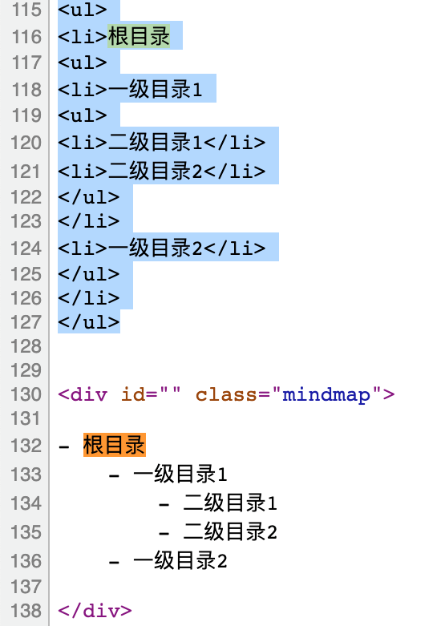
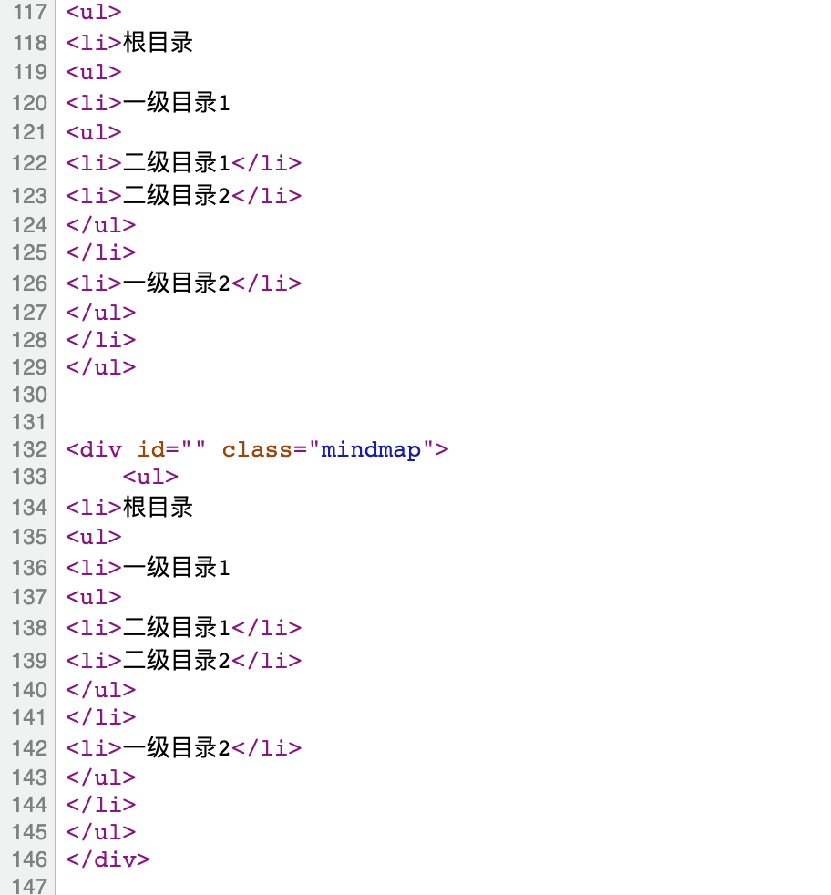

# ShortCode 整理



This is a *paragraph* with **typing animation** based on [TypeIt](https://typeitjs.com/)...


整理一下最近加入的shortcode，`{{}}`會錯誤所以都用`{}`代替，不然會變成這樣，今天換了Loveit發現主題內建了mermaid，所以就改檔案名，暫時擺著，順便加上Loveit有的shortcode，文檔有蠻多可以用的，就去不全部放了。

## Mindmap

```md
{< mind >}
- 根目錄
    - 一級目錄1
        - 二級目錄1
        - 二級目錄2
    - 一級目錄2
{< /mind >}
```


- 根目录
    - 一級目錄1
        - 二級目錄1
        - 二級目錄2
    - 一級目錄2



[unordered-list-to-mind-map](https://github.com/HunterXuan/unordered-list-to-mind-map)放到`/static/mind`/目錄下面，然後加入`/layouts/shortcodes/mind.html`的全局shortcode，關於這個shortcode我要說一下，在我這裡`{{ .Inner }}`不行用，要用`{{ .Inner | markdownify }}`，就看一下結果就知道了，就mindmap.js檔案寫的內容，如果可以改用`#`更好，不過`<h1><h2><h3>`這種tag看起來寫起來就很麻煩。






```html
<!-- from https://github.com/HunterXuan/unordered-list-to-mind-map -->
<div id="{{ .Get 0 }}" class="mindmap mindmap-lg" style="width:100%;height:300px;border:3px #cccccc dashed;">
    {{ .Inner | markdownify }}
</div>

<script src="https://code.jquery.com/jquery-3.3.1.min.js"></script>
<script src="/mind/jquery-3.3.1.min.js"></script>
<link href="/mind/mindmap.css" rel="stylesheet">
<script src="/mind/kity.min.js"></script>
<script src="/mind/kityminder.core.min.js"></script>
<!-- <script src="/mind/mindmap.min.js"></script> -->

<!-- minder 重複加載會顯示我們不想要的結果選一個不加載或是直接刪除檔案 -->
<!-- <script src="/mind/mindmap.js"></script> --> 
```

再來就是`mindmap.js`重複加載的問題，這個檔案重複加載，也就是畫了兩個圖會出現問題，直接變成四個圖，所以要處理一下，出現了圖重複的狀況。

我是直接對`kityminder`、`kitty`這兩個物件名稱做判斷（在瀏覽器找到就直接用了），原因就是每次會用到它的時候大概也是用在這裡，不過似乎不行，可能跟hugo的內部執行順序有關，所以最後還是加到theme裡面，我自己是加載在`theme/layout/posts/single.html`的`</article>`上面一點的地方。

```html
<script>
if (typeof jQuery != "undefined" || typeof kityminder != "undefined") {
	// do something  不能用document.write
	var s=document.createElement('script');
	s.src='/mind/mindmap.min.js';
	document.body.appendChild(s);
}
</script>
```

## Typeit


打字 [TypeIt](https://typeitjs.com/) 的 **打字動畫** 的 *段落*...


```md
打字 TypeIt 的 打字動畫 的 段落…|


{< typeit >}
打字 [TypeIt](https://typeitjs.com/) 的 **打字動畫** 的 *段落*...
{< /typeit >}
```



public class HelloWorld {
    public static void main(String []args) {
        System.out.println("Hello World");
    }
}


```md
{< typeit code=java >}
public class HelloWorld {
    public static void main(String []args) {
        System.out.println("Hello World");
    }
}
{< /typeit >}
```

下面用 `{< typeit code=C# >}`，`{< typeit code=python >}` 測試



private void Read_btn_Click(object sender, RoutedEventArgs e) {
RfidMeRead();
    if (rawtag == "-1" || rawtag == "A problem occured while communicating with the reader: RFIDME")
    {
        RfidMeEPC = "No tag read !";
    }
    else
    {
        RfidMeEPC = rawtag;
    }
}



class WeatherIterable(Iterable): ## 可以疊代物件
  def __init__(self,cities):
    self.cities = cities
    pass
  
  def __iter__(self):
    return WeatherIterator(self.cities)|



## Plotly



```md
{< plotly ns3_ofdm_yans_wifi_model_subplot >}
```

## Music

use Roland JV-1080 vst, kontakt somthing wrong



add other kontakt with Roland JV-1080 vst




```md
{< music url="/audio/abelton_remix.wav" name="Remix from abelton Live" artist=NaN cover="/cover/avator.jpg" >}
```

## Mapbox

再找個時間看一下語言設定，座標與Google Map複製的座標貼上順序相反。





```md
{< mapbox 121.56061923804162 25.04417192846157  10 false "mapbox://styles/mapbox/streets-zh-v1" >}

Zh style
{< mapbox -122.252 37.453 10 false "mapbox://styles/mapbox/streets-zh-v1" >}

Eng style
{< mapbox -122.252 37.453 10 false "mapbox://styles/mapbox/streets-v11" >}
```

## MS view

```html
<br>
<iframe src='https://view.officeapps.live.com/op/embed.aspx?src=your_URL' width='98%' height='500px' frameborder='0'>
</iframe>
<br>
```


- Office file
    - ('.ppt’ ‘.pptx’ ‘.doc’, ‘.docx’, ‘.xls’, ‘.xlsx’)


## Google View

```html
<br>
<iframe src='https://docs.google.com/viewer?url=you_URL&embedded=true' width='98%' height='700px' frameborder='0'>
</iframe>
<br>
```

-  Image files (.JPEG, .PNG, .GIF, .TIFF, .BMP)
- Video files (WebM, .MPEG4, .3GPP, .MOV, .AVI, .MPEGPS, .WMV, .FLV)
- Text files (.TXT)
- Markup/Code (.CSS, .HTML, .PHP, .C, .CPP, .H, .HPP, .JS)
- Microsoft Word (.DOC and .DOCX)
- Microsoft Excel (.XLS and .XLSX)
- Microsoft PowerPoint (.PPT and .PPTX)
- Adobe Portable Document Format (.PDF)
- Apple Pages (.PAGES)
- Adobe Illustrator (.AI)
- Adobe Photoshop (.PSD)
- Tagged Image File Format (.TIFF)
- Autodesk AutoCad (.DXF)
- Scalable Vector Graphics (.SVG)
- PostScript (.EPS, .PS)
- TrueType (.TTF)
- XML Paper Specification (.XPS)
- Archive file types (.ZIP and .RAR)

