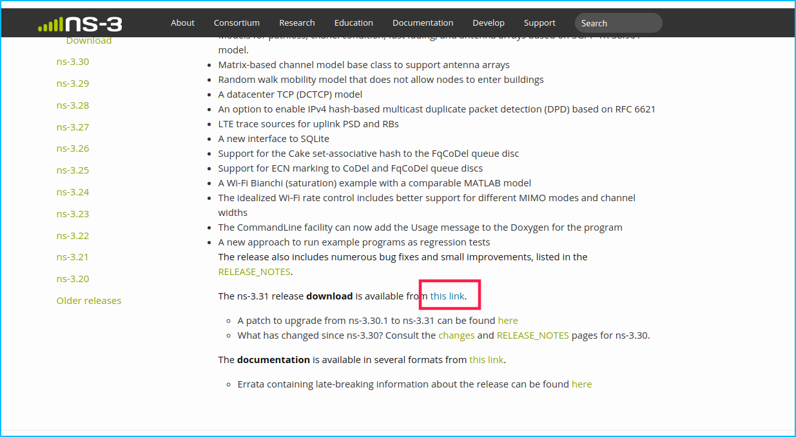

# Ns3 day 1


ns3 is build with the waf-tools whitch is based on python, so we need to learn how to configure and build the modules with it.

First，copy the links.



switch to terminal and download

```sh
wget url
tar -jxvf file
# make alias or not
```

[](https://asciinema.org/a/Z4Yip8Uut840XQu3JbD29sw4p)


## Bassic useage


- waf
    - configure
        - "--enable-tests"
        - "--enable-examples"
        - "--build-profil=debug"
        - "--with-python=python2"
        - "disable-python"
    - build
    - run


### Full Build

```sh
./waf confiugre --enable-tests --enable-examples
./waf
or
./waf build
or
./waf -vvv
```

[](https://asciinema.org/a/50aIrGsOOeg3M3DEum1pAm1Zy)

### Build core module only

```sh
./waf confiugre --enable-tests --enable-examples --enable-modules=core
```

[](https://asciinema.org/a/EKKZp60dxkwn6txIBxn1oqvPt)

building log is at build/config.log

```sh
cat build/config.log
```

## Running Program

```sh
./waf --run sample-simulator
./waf --run src/core/examples/sample-simulator # file.cc
## configure add --with-python=python2 need pybindgen
./waf --pyrun src/core/examples/sample-simulator.py
```

## Build variations


- waf
  - debugging code enable
    - "./waf -d debug configure"
  - optimized
    - "./waf -d optimized configure"
  - static libs
    - "./waf --enable-static configure"


## Add modules and check dependency

cat the file of wscript in the src/module_name


- wscript
  - Contents for waf-tools
    - module file index
    - test file index
    - example file indx
    - API header index
    - pybindgen binding


```py
cat src/propagation/wscript | more
## -*- Mode: python; py-indent-offset: 4; indent-tabs-mode: nil; coding: utf-8; -*-

def build(bld):
    module = bld.create_ns3_module('propagation', ['network', 'mobility'])
    module.includes = '.'
    module.source = [
        'model/propagation-delay-model.cc',
        'model/propagation-loss-model.cc',
        'model/jakes-propagation-loss-model.cc',
        'model/jakes-process.cc',
        'model/cost231-propagation-loss-model.cc',
        'model/okumura-hata-propagation-loss-model.cc',
        'model/itu-r-1411-los-propagation-loss-model.cc',
        'model/itu-r-1411-nlos-over-rooftop-propagation-loss-model.cc',
        'model/kun-2600-mhz-propagation-loss-model.cc',
        'model/channel-condition-model.cc',
--更多--
```

In this script we know the propagation module need the network and mobility modules, and build the source file (modulename/model/*) to ns3/model_name.

and call with, more you can see the example of core module `sample-simulator.cc` and `sample-simulator.py`

```cpp
#include "ns3/jakes-propagation-loss-model.h"
```

```py
import ns.propagation
```

```py
module_test.source = [
        'test/propagation-loss-model-test-suite.cc',
        'test/okumura-hata-test-suite.cc',
        'test/itu-r-1411-los-test-suite.cc',
        'test/kun-2600-mhz-test-suite.cc',
        'test/itu-r-1411-nlos-over-rooftop-test-suite.cc',
        'test/channel-condition-model-test-suite.cc',
        'test/three-gpp-propagation-loss-model-test-suite.cc',
        ]
    # Tests encapsulating example programs should be listed here
    if (bld.env['ENABLE_EXAMPLES']):
        module_test.source.extend([
        #   'test/propagation-examples-test-suite.cc',
            ])
```

You can try if you build propagation module, if you `--enable-tests`, `--enable-examples`, it can recognize the file without full path.

```sh
./waf configure --enable-tests --enable-examples --enable-module=core 
./waf # build
```

```py
    headers = bld(features='ns3header')
    headers.module = 'propagation'
    headers.source = [
        'model/propagation-delay-model.h',
        'model/propagation-loss-model.h',
        'model/jakes-propagation-loss-model.h',
        'model/jakes-process.h',
        'model/propagation-cache.h',
        'model/cost231-propagation-loss-model.h',
        'model/propagation-environment.h',
        'model/okumura-hata-propagation-loss-model.h',
        'model/itu-r-1411-los-propagation-loss-model.h',
        'model/itu-r-1411-nlos-over-rooftop-propagation-loss-model.h',
        'model/kun-2600-mhz-propagation-loss-model.h',
        'model/channel-condition-model.h',
        'model/three-gpp-propagation-loss-model.h',
        ]

    if (bld.env['ENABLE_EXAMPLES']):
        bld.recurse('examples')

    bld.ns3_python_bindings()
```

It is the API headers of the module, should be the public API, but some of them may private.

## Running Code

```sh
./waf --run scratch-simulator
./waf --run scratch/scratch-simulator
cp scratch/scratch-simulator.cc scratch/wss.cc
./waf
./waf wss
```

[](https://asciinema.org/a/n2L9eVwqq4LjYJf4GfcK2gycv)

### Add subdir

You can build more complicated example with this functionality.

```sh
cd scratch/
tree
.
├── scratch-simulator.cc
└── subdir
    └── scratch-simulator-subdir.cc
cd ..
./waf --run scratch/subdir/scratch-simulator-subdir # failed
./waf --run scratch/subdir # failed
./waf --run subdir # correct
```

[](https://asciinema.org/a/AC67jPbIW5CbIIqV8t4HH4c6h)

## Other configure parameters

```sh
(base) ➜  ns-3.31 ls -alh utils | grep ".ns3rc"
-rwxrwxrwx 1 geek geek  405  7月  4 14:55 .ns3rc
cat utils/.ns3rc
#! /usr/bin/env python

# A list of the modules that will be enabled when ns-3 is run.
# Modules that depend on the listed modules will be enabled also.
#
# All modules can be enabled by choosing 'all_modules'.
modules_enabled = ['all_modules']

# Set this equal to true if you want examples to be run.
examples_enabled = False

# Set this equal to true if you want tests to be run.
tests_enabled = False
```

In this file you can set something for waf configure.

```sh
cp utils/.ns3rc .
vi utils/.ns3rc
./waf configure --enable-modules='core','network','mobility','propagation' --with-python=python2
./waf
```

[](https://asciinema.org/a/I4yWyDxBxKGLVP01mK7xECvx4)

## GCC compile parameters

`ns3/build/c4che/_c4che.py` have the very detial settings of the gcc compiler. If you familier with gcc, you can change your compiler flags when it need.

for example you can remove all the `-Werror` in the file, you can look at [doc](https://gcc.gnu.org/onlinedocs/gcc/Warning-Options.html) and [-Werror is Not Your Friend](https://embeddedartistry.com/blog/2017/05/22/werror-is-not-your-friend/) for more info.

## To run test and example file

if I configure with `--enable-modules='core','network','mobility','propagation'`

```sh
./waf configure --enable-modules='core','network','mobility','propagation'  --enable-tests --enable-examples
cp src/propagation/examples/jakes-propagation-model-example.cc scratch
./waf # build success
./waf --run jakes-propagation-model-example # ok
```

## Debug the program

Debug the program by using waf-tool, the debuger based on gdb, if you use this tool, you need to add the code below.

```cpp
#include "ns3/command-line.h"
using namespace ns3;
int main (int argc, char *argv[])
{
  CommandLine cmd (__FILE__);
  cmd.Parse (argc, argv);
}
```

```py
import ns.core
def main(dummy_argv):
    ns.core.CommandLine().Parse(dummy_argv)
    pass
```


- gdb log on NS3
    - Print
        - PrintHelp (or just --help)
        - PrintGolbals
        - PrintTypeIds


- PrintHelp

```sh
(base) ➜  ns-3.31 ./waf --run  "sample-simulator --help"
sample-simulator [General Arguments]

General Arguments:
    --PrintGlobals:              Print the list of globals.
    --PrintGroups:               Print the list of groups.
    --PrintGroup=[group]:        Print all TypeIds of group.
    --PrintTypeIds:              Print all TypeIds.
    --PrintAttributes=[typeid]:  Print all attributes of typeid.
    --PrintHelp:                 Print this help message.
```

- PrintGlobals

```sh
(base) ➜  ns-3.31 ./waf --run  "sample-simulator --PrintGlobals"
Global values:
    --RngRun=[1]
        The substream index used for all streams
    --RngSeed=[1]
        The global seed of all rng streams
    --SchedulerType=[ns3::MapScheduler]
        The object class to use as the scheduler implementation
    --SimulatorImplementationType=[ns3::DefaultSimulatorImpl]
        The object class to use as the simulator implementation
```

- PrintTypeIds

```sh
(base) ➜  ns-3.31 ./waf --run  "sample-simulator --PrintTypeIds"
Registered TypeIds:
    ns3::CalendarScheduler
    ns3::ConstantRandomVariable
    ns3::DefaultSimulatorImpl
    ns3::DeterministicRandomVariable
    ns3::EmpiricalRandomVariable
    ns3::ErlangRandomVariable
    ns3::ExponentialRandomVariable
    ns3::GammaRandomVariable
    ns3::HeapScheduler
    ns3::ListScheduler
    ns3::LogNormalRandomVariable
    ns3::MapScheduler
    ns3::NormalRandomVariable
    ns3::Object
    ns3::ObjectBase
    ns3::ParetoRandomVariable
    ns3::PriorityQueueScheduler
    ns3::RandomVariableStream
    ns3::RealtimeSimulatorImpl
    ns3::Scheduler
    ns3::SequentialRandomVariable
    ns3::SimulatorImpl
    ns3::Synchronizer
    ns3::TriangularRandomVariable
    ns3::UniformRandomVariable
    ns3::WallClockSynchronizer
    ns3::WeibullRandomVariable
    ns3::ZetaRandomVariable
    ns3::ZipfRandomVariable
```

- Example

```sh
./waf --run  "sample-simulator --PrintAttributes=ns3::UniformRandomVariable"
Attributes for TypeId ns3::UniformRandomVariable
    --ns3::UniformRandomVariable::Max=[1]
        The upper bound on the values returned by this RNG stream.
    --ns3::UniformRandomVariable::Min=[0]
        The lower bound on the values returned by this RNG stream.
```

- Change Global value to test

```sh
./waf --run "sample-simulator --SimulatorImplementationType=ns3::RealtimeSimulatorImpl"
'build' finished successfully (2.940s)
ExampleFunction received event at 10s
RandomFunction received event at 18.1653s
Member method received event at 20s started at 10s
^CInterrupted
```

### Pure gdb

#### CPP

See more at [doc](https://www.nsnam.org/wiki/HOWTO_use_gdb_to_debug_program_errors)

```sh
./waf --command-template="gdb %s" --run third
(gdb) r --help
(gdb) run --nWifi=0
...
Program received signal SIGSEGV, Segmentation fault.
0x0000000000413ac9 in ns3::PeekPointer<ns3::Node> (p=...) at ./ns3/ptr.h:282
282	  return p.m_ptr;
(gdb) 
```

#### Python

See more at [doc](https://www.nsnam.org/docs/manual/html/python.html)

```sh
./waf shell
$ gdb --args python examples/wireless/mixed-wireless.py
```

## Ref

The ns3 2015 training videos and ppts, the videos is available at their official website. [video](https://vimeo.com/showcase/3480129)








### For more gdb skills


