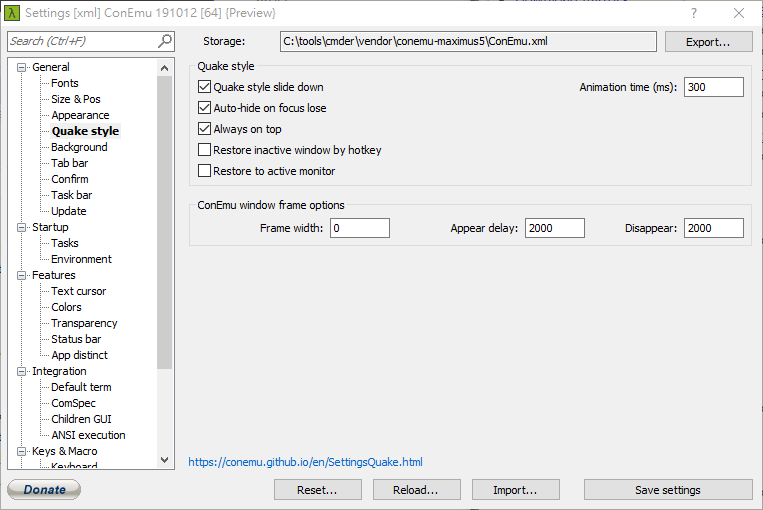
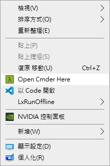

# Dropdown Terminal


Resently, I use the Manjaro KDE, and I very love the functionilary of the dropdown terminal.

Today I wanna install it on my own PC and MacOS.

## On Windows

```ps
choco install cmder
```


the *.reg file for enable the shortcut, save it and double click

```reg
Windows Registry Editor Version 5.00

[HKEY_CLASSES_ROOT\Directory\Background\shell\Cmder]
@="Open Cmder Here"
"Icon"="C:\\tools\\cmder\\Cmder.exe,0"

[HKEY_CLASSES_ROOT\Directory\Background\shell\Cmder\command]
@="\"C:\\tools\\cmder\\Cmder.exe\" \"%V\""

[HKEY_CLASSES_ROOT\Directory\shell\Cmder]
@="Open Cmder Here"
"Icon"="C:\\tools\\cmder\\Cmder.exe,0"

[HKEY_CLASSES_ROOT\Directory\shell\Cmder\command]
@="\"C:\\tools\\cmder\\Cmder.exe\" \"%1\""
```



Then you can use the <kbd>Ctrl</kbd> + <kbd>~</kbd>  to open the drop down terminal.

### wsl install to other disk

```powershell
choco install lxrunoffline
icacls D:\virtual_machine\wsl /grant "chenw:(OI)(CI)(F)" # give permision to open
lxrunoffline list
Ubuntu-18.04
lxrunoffline move -n Ubuntu-18.04 -d D:\wsl\virtual_machine\installed\Ubuntu-18.04 # wait for it
lxrunoffline get-dir -n Ubuntu-18.04
D:\virtual_machine\wsl\installed\Ubuntu-18.04
```

### ssh in wsl

You need to add more permision setting on `~/.ssh/config` file

```bash
git config --global user.name "git_username"
git config --global user.email "git_email"
mkdir ~/.ssh
touch ~/.ssh/config
nano ~/.ssh/config
```

### sublime 

```sh  
{
	"always_prompt_for_file_reload": false,
	"close_windows_when_empty": true,
	"remember_open_files": false,
	"hot_exit": false,
    "remember_open_files": false
}
```

### Trace down all Wifi

Trace down all wifi password in your windows

```bat
for /f "skip=9 tokens=1,2 delims=:" %i in ('netsh wlan show profiles') do @echo %j | findstr -i -v echo | netsh wlan show profiles %j key=clear
```

## On MacOS

```bash
brew cask instal iterm2
```


