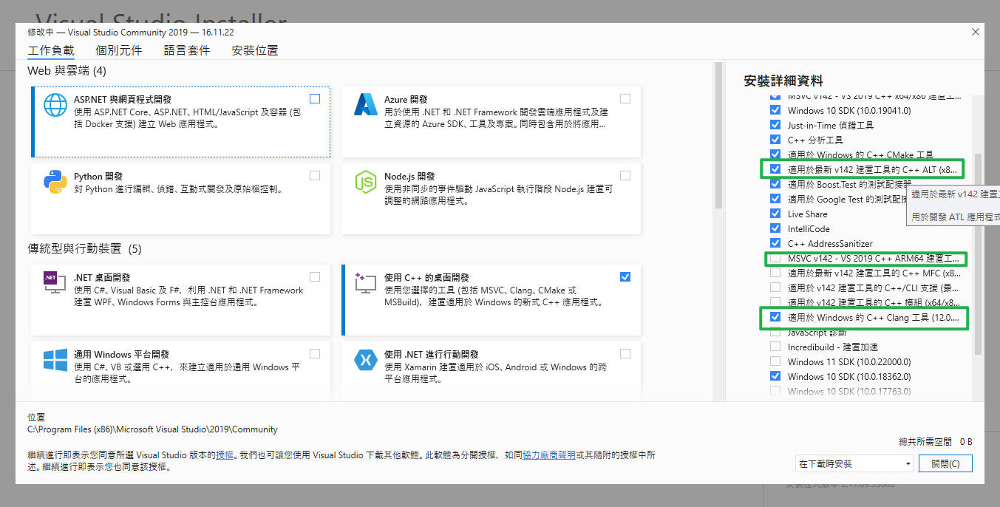
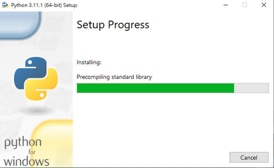

# Build EDK source code


## Ubuntu 18.04

```sh  
:: disable Right Click show more on Win11
reg add HKCU\Software\Classes\CLSID\{86ca1aa0-34aa-4e8b-a509-50c905bae2a2}\InprocServer32 /ve /d "" /f
:: enable Right Click show more on Win11
reg delete "HKEY_CURRENT_USER\Software\Classes\CLSID\{86ca1aa0-34aa-4e8b-a509-50c905bae2a2}" /f​

:: enable wsl
dism.exe /online /enable-feature /featurename:Microsoft-Windows-Subsystem-Linux /all /norestart
:: enable vm
dism.exe /online /enable-feature /featurename:VirtualMachinePlatform /all /norestart
:: set to wsl version 2
wsl --set-default-version 2

# 設定完密碼之後設定root 密碼
passwd root 
## Windows Store 安裝Ubuntu 18.04
```

```sh
choco install vcxsrv # for x11 display
# or
choco install mobaxterm # x11 display
```

照着[ARM-Developer](https://developer.arm.com/documentation/102571/0100/Build-firmware-on-a-Linux-host)步驟建立EDK2環境

```sh  
sudo apt install python python3 python3-distutils uuid-dev build-essential bison flex
# for emulator VM
sudo apt-get install qemu qemu-system-x86 

# for X64 build
sudo apt-get install
# sudo apt-get install nasm # update a version
# https://www.linuxfromscratch.org/blfs/view/svn/general/nasm.html
wget https://www.nasm.us/pub/nasm/releasebuilds/2.16.01/nasm-2.16.01.tar.xz # build source

# x11-apps and some header for edk2 build x11 display
sudo apt-get install x11-apps
export DISPLAY=127.0.0.1:0 # for x11 display port

cd source
export WORKSPACE=$PWD
git clone https://github.com/tianocore/edk2-platforms.git
git clone https://github.com/acpica/acpica.git
git clone https://github.com/tianocore/edk2.git
cd edk2
git tag -l
git checkout -f --recurse-submodules tags/release_tag
git submodule update --init
cd $WORKSPACE # equal cd ../
```

### Build ACPICA for ARM

```sh  
## arm toolchain
mkdir $WORKSPACE/toolchain
cd $WORKSPACE/toolchain
wget https://armkeil.blob.core.windows.net/developer/Files/downloads/gnu-a/9.2-2019.12/binrel/gcc-arm-9.2-2019.12-x86_64-aarch64-none-elf.tar.xz
tar xvf gcc-arm-9.2-2019.12-x86_64-aarch64-none-elf.tar.xz

cd $WORKSPACE
make -C $WORKSPACE/acpica
make: Entering directory '/mnt/c/source/acpica'
make[1]: Entering directory '/mnt/c/source/acpica/generate/unix/acpibin'
obj/acpibin ../../../source/tools/acpibin/abcompare.c
In file included from ../../../source/include/actbl.h:549:0,
                 from ../../../source/include/acpi.h:169,
                 from ../../../source/tools/acpibin/acpibin.h:152,
                 from ../../../source/tools/acpibin/abcompare.c:152:
../../../source/include/actbl2.h:1553:29: error: flexible array member in a struct with no named members
     UINT8                   OemData[];
                             ^~~~~~~
../Makefile.rules:19: recipe for target 'obj/abcompare.o' failed
make[1]: *** [obj/abcompare.o] Error 1
make[1]: Leaving directory '/mnt/c/source/acpica/generate/unix/acpibin'
generate/unix/Makefile.common:7: recipe for target 'acpibin' failed
make: *** [acpibin] Error 2
make: Leaving directory '/mnt/c/source/acpica'

# build 不過退版本
cd acpica 
git log -3 --oneline
git checkout -f 9166abc0d
make -C .
cd $WORKSPACE
```

### Build EDK

```sh  
export GCC5_AARCH64_PREFIX=$WORKSPACE/toolchain/gcc-arm-9.2-2019.12-x86_64-aarch64-none-elf/bin/aarch64-none-elf-
export PACKAGES_PATH=$WORKSPACE/edk2:$WORKSPACE/edk2-platforms
export IASL_PREFIX=$WORKSPACE/acpica/generate/unix/bin/
export PYTHON_COMMAND=/usr/bin/python
export PYTHON_COMMAND=/usr/bin/python3
source edk2/edksetup.sh
make -C edk2/BaseTools
# 失敗可以看 git status, checkout 回去再試一次看看
```


確定都Build成功後可以開始建立環境build code

`env.sh`

```sh
export WORKSPACE=$PWD
export GCC5_AARCH64_PREFIX=$WORKSPACE/toolchain/gcc-arm-9.2-2019.12-x86_64-aarch64-none-elf/bin/aarch64-none-elf-
export PACKAGES_PATH=$WORKSPACE/edk2:$WORKSPACE/edk2-platforms
export IASL_PREFIX=$WORKSPACE/acpica/generate/unix/bin/
export PYTHON_COMMAND=/usr/bin/python
export PYTHON_COMMAND=/usr/bin/python3
source edk2/edksetup.sh
```


`rel.sh`: build release

```sh  
rm -rf Build/OvmfX64/RELEASE_GCC5/X64/MdeModulePkg/Application/HelloWorld
build -a X64 -t GCC5 -p edk2/OvmfPkg/OvmfPkgX64.dsc -b RELEASE
# build -a X64 -t GCC5 -p edk2/OvmfPkg/OvmfPkgX64.dsc -b DEBUG
# build -a X64 -t GCC5 -p edk2/OvmfPkg/OvmfPkgX64.dsc -b DEBUG -D DEBUG_ON_SERIAL_PORT

qemu-system-x86_64 -bios Build/OvmfX64/RELEASE_GCC5/FV/OVMF.fd -M pc -m 10240 -cpu qemu64 -name UEFI -boot order=dc -hda fat:rw:Build/OvmfX64/RELEASE_GCC5/X64/MdeModulePkg/Application/HelloWorld/HelloWorld/OUTPUT -nographic
# qemu-system-x86_64 -bios Build/OvmfX64/RELEASE_GCC5/FV/OVMF.fd -M pc -m 10240 -cpu qemu64 -vga cirrus -name UEFI -boot order=dc -hda fat:rw:Build/OvmfX64/RELEASE_GCC5/ -serial stdio
# qemu-system-x86_64 -bios Build/OvmfX64/RELEASE_GCC5/FV/OVMF.fd -M pc -m 10240 -cpu qemu64 -vga cirrus -name UEFI -boot order=dc -hda fat:rw:Build/OvmfX64/DEBUG_GCC5/X64/MdeModulePkg/Application/HelloWorld/HelloWorld/OUTPUT -serial stdio
# qemu-system-x86_64 -bios Build/OvmfX64/RELEASE_GCC5/FV/OVMF.fd -M pc -m 10240 -cpu qemu64 -vga cirrus -name UEFI -boot order=dc -hda fat:rw:Build/OvmfX64/RELEASE_GCC5/X64/MdeModulePkg/Application/HelloWorld/HelloWorld/OUTPUT -serial stdio
# qemu-system-x86_64 -bios Build/OvmfX64/RELEASE_GCC5/FV/OVMF.fd -M pc -m 10240 -cpu qemu64 -vga cirrus -name UEFI -boot order=dc -hda fat:rw:Build/OvmfX64/RELEASE_GCC5/ -serial stdio
```

`deg.sh`: build debug

```sh  
build -a X64 -t GCC5 -p edk2/OvmfPkg/OvmfPkgX64.dsc -b DEBUG -D DEBUG_ON_SERIAL_PORT
qemu-system-x86_64 -bios Build/OvmfX64/RELEASE_GCC5/FV/OVMF.fd -M pc -m 10240 -cpu qemu64 -vga cirrus -name UEFI -boot order=dc -hda fat:rw:Build/OvmfX64/DEBUG_GCC5/X64/MdeModulePkg/Application/HelloWorld/HelloWorld/OUTPUT -nographic -serial stdio
```

## Windows

```sh 
choco install mingw qemu nasm
choco install visualstudio2019community

mkdir source
cd source
git clone https://github.com/tianocore/edk2-platforms.git
git clone https://github.com/acpica/acpica.git
git clone https://github.com/tianocore/edk2.git
cd edk2
git tag -l
git checkout -f --recurse-submodules tags/release_tag
git submodule update --init
```

修改Visual Studio建置環境



安裝Python



`env.bat`

```bat
:: remove mobaterm slash\echo
:: call setpath_moba.bat

:: set PYTHON_COMMAND=C:\Python27\python.exe
set PACKAGES_PATH=C:\source\edk2-platforms;C:\source\edk2
set PYTHON3_ENABLE=TRUE
set PYTHON_HOME=C:\Python311
set NASM_PREFIX=C:\Program Files\NASM\
:: set CYGWIN_HOME=C:\ProgramData\chocolatey\lib\Cygwin
set CYGWIN_HOME=C:\source\edk2\BaseTools\Bin\CYGWIN_NT-5.1-i686
set CLANG_BIN=C:\ProgramData\chocolatey\lib\mingw\tools\install\mingw64\bin

:: if X86 IA32 put IASL exe files to C:\ASL\

.\edk2\edksetup.bat Rebuild  && .\edk2\edksetup.bat VS2019
```

`rel.bat`

```bat
:: build -a X64 -t VS2019 -p EmulatorPkg\EmulatorPkg.dsc -b RELEASE

call build -a X64 -t VS2019 -p OvmfPkg/OvmfPkgX64.dsc -b RELEASE 

echo Press to Emulate
pause

rem Get user input
set /p strr=Load HelloWorld or not(Y/N): 
if %strr%==Y (echo HelloWorld PATH )else ( GOTO MODULE)

call qemu-system-x86_64 -bios edk2\Build\OvmfX64\RELEASE_VS2019\FV\OVMF.fd -hda fat:rw:edk2\Build\OvmfX64\RELEASE_VS2019\X64\MdeModulePkg\Application\HelloWorld\HelloWorld\OUTPUT -nographic
GOTO:EOF

:MODULE
call qemu-system-x86_64 -bios edk2\Build\OvmfX64\RELEASE_VS2019\FV\OVMF.fd -hda fat:rw:edk2\Build\OvmfX64\RELEASE_VS2019\X64 -serial stdio
GOTO:EOF
```


## Build Intel Board Package

查看，需要安裝FSP並加入環境變量build code，FSP之後再來研究

C:\source\edk2-platforms\Platform\Intel\Readme.md


```sh  
cd source
env.bat
##  env.bat add one line
set PACKAGES_PATH=%PACKAGES_PATH%;c:\source\edk2-platforms\Platform\Intel;c:\source\edk2-platforms\Silicon\Intel;c:\source\edk2-platforms\Features\Intel

## 文件中寫
build -p BoardModulePkg/BoardModulePkg.dsc -a IA32 -a X64

# 修改爲
build -t VS2019 -p BoardModulePkg/BoardModulePkg.dsc -a X64
```


