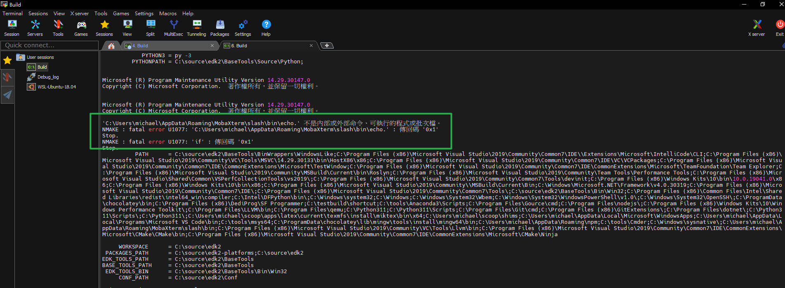

# MobaXterm Build EDK2




在Build EDK2的時候遇到一個問題造成無法成功，造成nmake編譯器產生錯誤

`env.bat`

```bat
:: set PYTHON_COMMAND=C:\Python27\python.exe
set PACKAGES_PATH=C:\source\edk2-platforms;C:\source\edk2
set PYTHON3_ENABLE=TRUE
set PYTHON_HOME=C:\Python311
set NASM_PREFIX=C:\Program Files\NASM\
:: set CYGWIN_HOME=C:\ProgramData\chocolatey\lib\Cygwin
set CYGWIN_HOME=C:\source\edk2\BaseTools\Bin\CYGWIN_NT-5.1-i686
set CLANG_BIN=C:\ProgramData\chocolatey\lib\mingw\tools\install\mingw64\bin

:: if X86 IA32 put IASL exe files to C:\ASL\

.\edk2\edksetup.bat Rebuild  && .\edk2\edksetup.bat VS2019
```




主要原因是因爲echo使用了MobaXterm的echo，只要把`slash\bin`從環境變量中刪除即可正確的Build Code了

```bat  
:: C:\Users\michael\AppData\Roaming\MobaXterm\slash\bin
:: %APPDATA%\MobaXterm\slash\bin

C:\Users\michael\AppData\Roaming\MobaXterm\slash\bin\echo.
```
